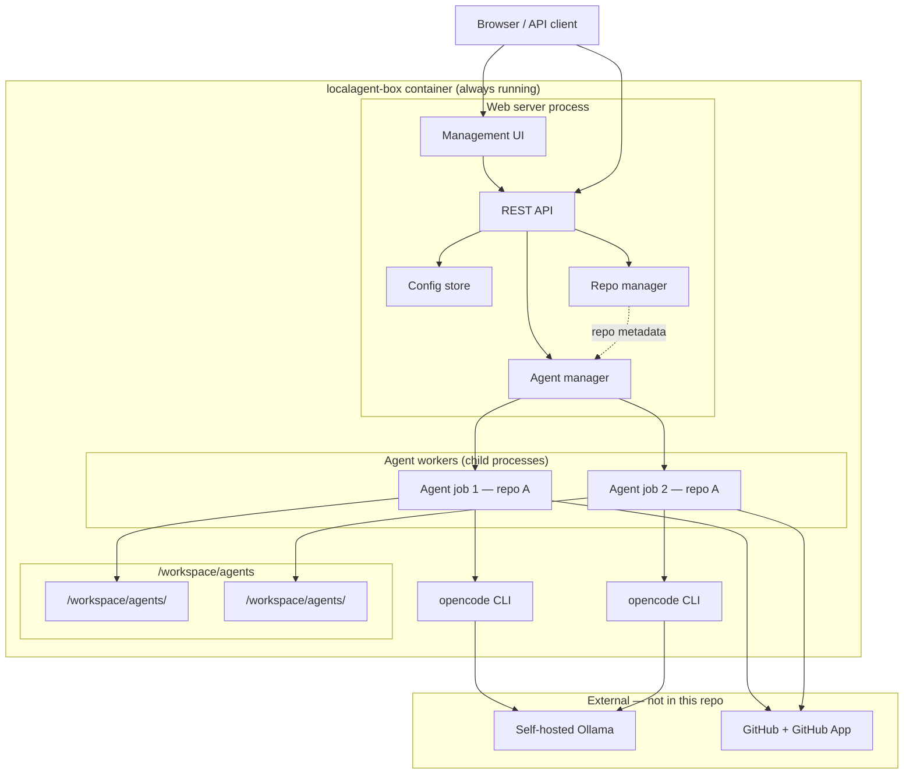

# Local Agent Box — Implementation Plan

A Docker-hostable, **long-running** instance of the [OpenCode](https://opencode.ai/docs/) AI agent tool. One container stays up; a lightweight web server provides management, configuration, and a REST API to start **repo-scoped agents** that run OpenCode independently inside the same container.

This plan is guided by the [README](./README.md) TODO list.

---

## Vision

Local Agent Box is a **persistent agent daemon**, not a one-shot job container.

1. Starts once and keeps running (Docker `restart: unless-stopped` or equivalent)
2. Exposes a **lightweight web server** for configuration and observability
3. Accepts API requests to spawn **repo-scoped agents** — each agent gets a **dedicated workspace** under `/workspace/agents/<workspaceId>/` where `workspaceId` is a randomly generated identifier (UUID)
4. Runs OpenCode **non-interactively** inside each agent worker, against a **self-hosted Ollama** instance (external to this repo)
5. Commits and pushes results via **GitHub App** HTTPS auth (no SSH)

Multiple agents may target the **same registered repo** at the same time; isolation comes from separate workspace directories and independent git clones, not from repo-level locking.

**Ollama is an external prerequisite.** This project configures OpenCode to call an Ollama URL; it does not install or run Ollama.

---

## Architecture



### Core concepts

| Concept | Description |
|---------|-------------|
| **Server** | Long-lived Node process: HTTP server, config, repo registry, agent scheduler |
| **Registered repo** | A GitHub repo catalog entry (`repoId`, owner, name, default branch) — metadata only, no shared on-disk clone |
| **Workspace** | Ephemeral directory `/workspace/agents/<workspaceId>/` created per agent job; `workspaceId` is a random UUID |
| **Agent (job)** | A single task against one registered repo: fresh clone → create branch → run OpenCode → commit/push → cleanup workspace |
| **Agent worker** | Isolated child process with its own workspace; multiple workers may run concurrently, including on the same `repoId` |

### Workspace ID generation

- Generate `workspaceId` with `crypto.randomUUID()` (or equivalent) when an agent is queued
- Path: `/workspace/agents/<workspaceId>/`
- Store `workspaceId` on the agent record for logs and debugging
- On completion, failure, or cancel: delete workspace directory (optional retention TTL via `WORKSPACE_RETENTION_HOURS` for post-mortem)

### Why one container, many agents

- Avoid Docker-per-job overhead and cold starts
- Central place for GitHub App credentials and Ollama/OpenCode settings
- Web UI for operators; API for automation (CI, bots, internal tools)
- Per-agent workspaces prevent git conflicts when multiple agents work the same repo in parallel

---

## Proposed Repository Layout

```
localagent-box/
├── Dockerfile
├── docker-compose.yml          # single long-running service + persistent volumes
├── entrypoint.sh               # start server, migrate data dir
├── package.json
├── src/
│   ├── server.js               # HTTP server bootstrap
│   ├── routes/
│   │   ├── health.js
│   │   ├── config.js           # Ollama, OpenCode, GitHub App settings
│   │   ├── repos.js            # register, verify repos
│   │   └── agents.js           # create, list, cancel, logs
│   ├── services/
│   │   ├── config-store.js     # read/write persisted settings
│   │   ├── github-app.js       # JWT → installation token
│   │   ├── repo-manager.js     # repo registry, URL resolution, access checks
│   │   ├── agent-manager.js    # spawn, track, limit concurrency, workspace lifecycle
│   │   └── opencode-runner.js  # invoke opencode CLI per job
│   └── lib/
│       └── validation.js       # repo URL, branch name sanitization
├── public/                     # optional static management UI
│   ├── index.html
│   └── app.js
├── config/
│   └── opencode.default.json   # template merged with server config
├── data/                       # gitignored; mounted volume at runtime
│   ├── config.json
│   ├── repos.json
│   └── agents/
├── PLAN.md
└── README.md
```

---

## Web Server & API

### Server bootstrap

- Listen on `PORT` (default `8080`)
- Bind `0.0.0.0` inside container; map port in Compose
- Persist state under `DATA_DIR` (default `/data`, volume-mounted)
- On startup: load config, verify Ollama reachability (warn if down), restore in-flight agent records

### Management UI (lightweight)

Minimal static or server-rendered pages — not a heavy frontend framework:

- **Settings** — Ollama URL, model, OpenCode provider; GitHub App ID, installation ID, private key path; git author name/email
- **Repos** — list registered repos, add repo (owner/name + default branch), verify GitHub access
- **Agents** — list active and historical jobs, submit new prompt, stream logs, cancel running job

### REST API (v1)

| Method | Path | Purpose |
|--------|------|---------|
| `GET` | `/health` | Liveness + Ollama connectivity summary |
| `GET` | `/api/v1/config` | Current settings (secrets redacted) |
| `PUT` | `/api/v1/config` | Update Ollama/OpenCode/GitHub/git author settings |
| `GET` | `/api/v1/repos` | List registered repos |
| `POST` | `/api/v1/repos` | Register repo `{ owner, name, defaultBranch }` (metadata only) |
| `POST` | `/api/v1/repos/:repoId/verify` | Verify GitHub App can access repo (optional shallow test clone to temp workspace) |
| `GET` | `/api/v1/agents` | List agents (filter by repo, status) |
| `POST` | `/api/v1/agents` | **Start repo-scoped agent** (see below) |
| `GET` | `/api/v1/agents/:agentId` | Status + result metadata |
| `GET` | `/api/v1/agents/:agentId/logs` | Stdout/stderr log stream or tail |
| `DELETE` | `/api/v1/agents/:agentId` | Cancel running agent |

#### Start agent request

```json
POST /api/v1/agents
{
  "repoId": "org-my-app",
  "prompt": "Add input validation to the login form",
  "baseBranch": "main",
  "agentBranch": "agent/task-42",
  "commitMessage": "Agent: add login validation",
  "push": true
}
```

#### Agent response (async)

```json
{
  "agentId": "a1b2c3d4",
  "workspaceId": "f47ac10b-58cc-4372-a567-0e02b2c3d479",
  "repoId": "org-my-app",
  "status": "queued",
  "createdAt": "2026-05-21T12:00:00Z"
}
```

Terminal states: `queued` → `running` → `completed` | `failed` | `cancelled`

Result payload on completion:

```json
{
  "agentId": "a1b2c3d4",
  "workspaceId": "f47ac10b-58cc-4372-a567-0e02b2c3d479",
  "status": "completed",
  "branch": "agent/task-42",
  "commitSha": "abc123",
  "pushed": true,
  "filesChanged": 4
}
```

### Agent worker lifecycle (inside container)

Each API-created agent runs through an isolated worker (child process) with its own randomly named workspace:

1. Generate `workspaceId` (UUID) and create `/workspace/agents/<workspaceId>/`
2. Mint fresh GitHub App installation token
3. Shallow clone registered repo into workspace: `git clone --depth 1 --branch baseBranch …`
4. `git checkout -b agentBranch`
5. Run `opencode` with `prompt` (non-interactive) with `cwd` set to workspace
6. If changes and success: `git commit` + `git push`
7. Update agent record + append logs under `DATA_DIR/agents/<agentId>/`
8. Remove `/workspace/agents/<workspaceId>/` (unless retention policy keeps it temporarily)

Concurrency: configurable `MAX_CONCURRENT_AGENTS` (default 2–4). **No repo-level lock** — two agents on the same `repoId` use different `workspaceId` directories and different `agentBranch` values.

---

## Implementation Phases (mapped to README TODO)

### Phase 1 — Docker image with OpenCode dependencies

**Goal:** Reproducible image that runs the long-lived server and can invoke `opencode`.

**Tasks:**

1. `Dockerfile` (fork from opencode-box baseline):
   - Base: `node:trixie`
   - Packages: `git`, `bash`, `curl`, `ca-certificates`, build toolchain
   - `npm install -g opencode-ai`
   - Copy Node app; `npm ci --omit=dev`
   - Create `/workspace`, `/data`, OpenCode dirs under `/home/node/.local/share/opencode` and `/home/node/.config/opencode`
   - Non-root `node` user
   - `CMD` starts server (via `entrypoint.sh`), not idle `tail`

2. `entrypoint.sh`: ensure data/workspace dirs exist, then `exec node src/server.js`

3. `.dockerignore`, `docker-compose.yml` with:
   - Single `localagent-box` service, `restart: unless-stopped`
   - Volumes: `agent-data:/data`, `agent-workspace:/workspace`
   - Port `8080:8080`
   - `OLLAMA_BASE_URL` via env (optional bootstrap; full config via API/UI)

**Acceptance criteria:**

- `docker build -t localagent-box .` succeeds
- `docker compose up` keeps container running
- `curl localhost:8080/health` returns 200
- `docker exec … opencode --version` works; process runs as non-root

**Status:** Implemented — Dockerfile, entrypoint, compose, and minimal `/health` server.

---

### Phase 2 — Lightweight web server (management + API shell)

**Goal:** Always-on HTTP server with config persistence and placeholder routes.

**Tasks:**

1. Add `src/server.js` (Express, Fastify, or Node `http` — keep dependencies minimal)
2. Implement `GET /health`, static `public/` management shell
3. `config-store.js`: read/write `DATA_DIR/config.json`
4. Stub routes for `/api/v1/config`, `/api/v1/repos`, `/api/v1/agents`
5. API key or basic auth for write endpoints (configurable token via env)

**Acceptance criteria:**

- Server survives restart with persisted config on volume
- UI loads in browser and shows current config (secrets masked)
- OpenAPI or README documents v1 endpoints

**Status:** Implemented — config store, API route stubs, bearer auth, management UI, README API docs.

---

### Phase 3 — OpenCode config for self-hosted Ollama

**Goal:** Server-managed OpenCode settings targeting an external Ollama instance.

**Prerequisite (operator):** Ollama running elsewhere; models already pulled on that host.

**Tasks:**

1. Config fields: `ollamaBaseUrl`, `opencodeModel`, `opencodeProvider` (default `ollama`)
2. On save: write OpenCode JSON to `/home/node/.config/opencode/` (and share path if needed)
3. `GET /health` includes Ollama probe: `GET {ollamaBaseUrl}/api/tags`
4. Expose settings in UI + `PUT /api/v1/config`

**Acceptance criteria:**

- Configurable via API/UI without rebuilding image
- Health reports Ollama up/down clearly
- Test agent (manual `opencode` invoke from container) succeeds against external Ollama
- No Ollama binaries or services in this repo

**Status:** Implemented — OpenCode config writer, Ollama health probe, UI status panel.

---

### Phase 4 — GitHub App auth (replace SSH)

**Goal:** Server mints short-lived tokens for clone/commit/push — no SSH.

**Tasks:**

1. Config fields: `githubAppId`, `githubAppInstallationId`, `githubAppPrivateKey` (PEM stored on volume, never logged)
2. `github-app.js`: JWT → installation access token (refresh per agent job)
3. Git global config: `user.name`, `user.email` from server config
4. HTTPS clone URL helper: `https://x-access-token:<token>@github.com/<owner>/<repo>.git`

**Acceptance criteria:**

- Server can clone a private repo with stored App credentials
- Tokens never appear in logs or API responses
- No SSH agent or `SSH_AUTH_SOCK` usage

**Status:** Implemented — JWT minting, installation tokens, git HTTPS clone helper, verify API, UI test panel.

---

### Phase 5 — Checkout git repo (repo registration)

**Goal:** Repo catalog inside the server; clones happen per agent workspace, not per registered repo.

**Tasks:**

1. `POST /api/v1/repos`: register `{ owner, name, defaultBranch }`
2. `repo-manager.js`:
   - Assign stable `repoId` (e.g. `owner-name`) for API references
   - Persist metadata in `DATA_DIR/repos.json` (no long-lived clone at this stage)
   - Resolve clone URL from owner/name + GitHub App token when an agent starts
3. `POST /api/v1/repos/:repoId/verify` (optional): test clone into a throwaway temp workspace, then delete
4. UI: add/list repos, show registration status

**Acceptance criteria:**

- Registered repos survive container restart (metadata on `/data` volume)
- Starting two agents for the same `repoId` creates two distinct workspace paths with different UUIDs
- Invalid repo URLs rejected

**Maps to README:** Checkout git repo (per-agent clone at job time)

**Status:** Implemented — repo catalog, register/verify/delete API, UI, clone helpers for Phase 6.

---

### Phase 6 — Create branch + accept agent command (agent API)

**Goal:** API to spawn repo-scoped agents; each agent checks out an isolated branch and accepts a prompt.

**Tasks:**

1. `agent-manager.js`:
   - Queue with `MAX_CONCURRENT_AGENTS`
   - On enqueue: assign random `workspaceId`, mkdir `/workspace/agents/<workspaceId>/`
   - Spawn child process per job (isolation for OpenCode + git state)
   - Persist status/logs under `DATA_DIR/agents/<agentId>/`
   - Cleanup workspace on terminal state (with optional retention window)
2. `POST /api/v1/agents`:
   - Validate `repoId`, `prompt`, `baseBranch`, `agentBranch` (unique `agentBranch` per concurrent job when pushing)
   - Worker: clone into workspace → checkout `baseBranch` → `git checkout -b agentBranch`
3. `GET /api/v1/agents`, `GET …/logs`, `DELETE …` cancel (cancel also removes workspace)
4. UI: submit prompt, pick repo, view live logs and `workspaceId`

**Acceptance criteria:**

- Multiple agents can run concurrently on different repos
- **Two agents on the same repo run in parallel** in separate `/workspace/agents/<uuid>/` directories
- Branch created before OpenCode runs; agent record shows `running`, `workspaceId`, and log tail

**Maps to README:** Create branch, Accept opencode command to execute

**Status:** Implemented — agent manager, worker child processes, branch checkout, agent API, log tail, cancel, UI.

---

### Phase 7 — Run OpenCode + commit and push

**Goal:** Complete the agent loop inside each worker.

**Tasks:**

1. `opencode-runner.js`:
   - Invoke non-interactive OpenCode (confirm CLI flags via [OpenCode CLI docs](https://opencode.ai/docs/cli/))
   - Capture stdout/stderr to agent log files
   - Enforce `agentTimeout` (default 3600s)
2. Post-run:
   - If success and dirty tree: `git add -A`, `git commit`, `git push -u origin agentBranch`
   - If no changes: complete with warning
   - If OpenCode fails: `failed` unless `pushOnFailure` set
3. Final agent record includes `commitSha`, `pushed`, `filesChanged`

**Acceptance criteria:**

- End-to-end: `POST /api/v1/agents` → pushed branch on GitHub
- Logs available via API during and after run
- Failed jobs do not push unless explicitly allowed

**Maps to README:** Commit and push code

**Status:** Implemented — `opencode-runner.js`, non-interactive `opencode run`, commit/push, `commitSha`/`pushed`/`filesChanged` on agent records.

---

## Deployment

### Docker Compose (primary)

```yaml
services:
  localagent-box:
    build: .
    image: localagent-box
    restart: unless-stopped
    ports:
      - "8080:8080"
    extra_hosts:
      - "host.docker.internal:host-gateway"
    environment:
      PORT: "8080"
      DATA_DIR: "/data"
      MAX_CONCURRENT_AGENTS: "3"
      WORKSPACE_RETENTION_HOURS: "0"   # 0 = delete workspace immediately after job
      AGENT_TIMEOUT: "3600"
      API_TOKEN: "${API_TOKEN}"   # required for mutating API calls
    volumes:
      - agent-data:/data
      - agent-workspace:/workspace

volumes:
  agent-data:
  agent-workspace:
```

Ollama URL is set via management UI or `PUT /api/v1/config` after first boot — not bundled in Compose.

### Single-container run

```bash
docker run -d --name localagent-box \
  --restart unless-stopped \
  -p 8080:8080 \
  -v localagent-data:/data \
  -v localagent-workspace:/workspace \
  -e API_TOKEN="your-secret" \
  localagent-box
```

Then configure Ollama + GitHub App via `http://localhost:8080` or API.

---

## Security Considerations

1. **Secrets on volume:** GitHub App private key and API token live in `DATA_DIR`; never in image layers.
2. **API auth:** Require `Authorization: Bearer <API_TOKEN>` (or similar) for config/repo/agent mutations.
3. **Network exposure:** Bind management port only on trusted interfaces; use reverse proxy + TLS in production.
4. **Token lifetime:** Mint fresh GitHub installation token per agent job (~1 hour max).
5. **Ollama:** External, trusted network only; no public Ollama without auth.
6. **Input validation:** Sanitize repo URLs, branch names, and prompts before shell/git invocation.
7. **Process isolation:** Run each agent as child process with its own random workspace path; never share a working tree between concurrent jobs.
8. **Workspace cleanup:** Delete `/workspace/agents/<workspaceId>/` after job completion to limit disk use; optional retention for debugging.
9. **Branch collisions:** When running parallel agents on one repo, require distinct `agentBranch` values (API returns 409 if branch already in use by an active job).

---

## Testing Strategy

| Layer | What to test |
|-------|----------------|
| Image | Build, server starts, non-root, volume persistence |
| Web server | Health, config CRUD, auth on write routes |
| Ollama | Health probe against external instance; OpenCode smoke test |
| GitHub App | Register repo, clone private repo, push branch |
| Agent API | Create agent, log tail, cancel, concurrent jobs on two repos **and same repo** |
| Integration | Full loop: register repo → POST agent → verify GitHub branch |

---

## Milestone Checklist

Aligned with [README.md](./README.md) TODO:

- [ ] **Build Docker image with opencode deps** — Phase 1
- [x] **Setup opencode config (self-hosted Ollama URL)** — Phase 3 (+ Phase 2 server)
- [x] **Use Github App Auth as a replacement for ssh** — Phase 4
- [x] **Checkout git repo** — Phase 5
- [x] **Create branch** — Phase 6
- [x] **Accept opencode command to execute** — Phase 6–7
- [x] **Commit and push code** — Phase 7

Additional (architecture-specific):

- [x] **Lightweight web server + management UI** — Phase 2
- [x] **Agent manager with concurrent repo-scoped workers** — Phase 6

### Post-MVP

- [ ] Webhook from GitHub to auto-start agents on issues/PR comments
- [ ] Auto-open PR after agent push
- [ ] SSE/WebSocket log streaming
- [ ] Per-repo OpenCode rules/instructions override
- [ ] Multi-arch image builds

---

## Open Questions

1. **OpenCode non-interactive CLI** — Confirm exact command (`opencode run`, flags) for pinned `opencode-ai` version.
2. **Worker model** — Child `node` processes vs shell scripts vs worker threads (child process preferred for isolation).
3. **Workspace retention** — Immediate delete vs keep for N hours after completion for debugging?
4. **PR automation** — Open PR from server after push, or leave manual?
5. **UI scope** — Minimal static HTML vs small SPA (keep static for v1).

---

## Recommended Build Order

1. Docker image + long-running server entry (Phase 1 refactor)
2. Web server, config store, health, auth (Phase 2)
3. Ollama/OpenCode config via API (Phase 3)
4. GitHub App + repo registration/clone (Phase 4 + 5)
5. Agent API + branch checkout + worker pool (Phase 6)
6. OpenCode execution + commit/push (Phase 7)

This order delivers a usable daemon early (health + config UI), then adds repo and agent capabilities incrementally.

---

## External Dependencies (out of scope)

| Dependency | Responsibility | This project provides |
|------------|----------------|---------------------|
| **Ollama server** | Operator installs, runs, upgrades, pulls models | Config field + health probe + OpenCode provider wiring |
| **Model availability** | Operator ensures model exists on Ollama | `opencodeModel` in server config |
| **Network path** | Operator ensures container reaches Ollama | Documented URL patterns + health check |
| **GitHub App** | Operator creates app, installs on repos | Secure storage + token mint + git HTTPS |
