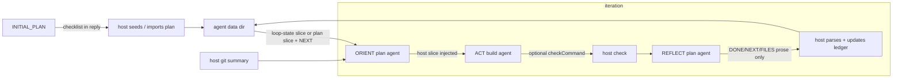

# Loop mode — handoff efficiency

Make iteration-to-iteration handoff cheaper in **tokens** and **wall-clock time** by treating progress state as **host-owned**, not model-maintained prose in the repo.

**Status:** Implemented (phases 1–7 on current branch; optional UI polish and integration tests remain)

**Related:** [loop-token-efficiency.plan.md](./loop-token-efficiency.plan.md), [loop-verb-models.plan.md](./loop-verb-models.plan.md), `src/domains/agents/worker/loop-run-flow.ts`, `src/domains/agents/worker/loop-handoff.ts`, `config/loop.default.json`, `src/domains/agents/worker/workspace-setup.ts`

---

## Goal

Loop agents rotate OpenCode sessions each iteration. The only carried context is what the host injects plus whatever the model re-reads from disk. **Before this work**, handoff was a dual-channel replay:

1. **File ledger** — `.localagent-box/loop-plan.md` (markdown checklist) in the workspace clone
2. **In-prompt replay** — full REFLECT output injected as `## Previous iteration summary` (capped at 2000 chars)

Both channels duplicated the same facts. ORIENT and REFLECT also paid **tool round-trips** to read/write the plan file.

**Target architecture (now live):**

```
REFLECT → small structured output → host parses → updates state → host injects minimal slice → ORIENT
```

The model produces deltas; the host is the authority on progress. State lives under `{dataDir}/agents/{agentId}/` (`loop-plan.md` + `loop-state.json`), with legacy import from workspace `.localagent-box/` after INITIAL_PLAN.

---

## Current flow



### Implemented

| Item | Location |
|------|----------|
| ORIENT merged from OBSERVE + PLAN | `config/loop.default.json`, `LoopVerb` type |
| Session rotation per iteration | `loop-run-flow.ts` (`rotateSession`) |
| Framing only on first step of session | `buildOpenCodePrompt({ includeFraming: stepIndex === 0 })` |
| Templated REFLECT output (DONE / REMAINING / NEXT / FILES) | `config/loop.default.json` REFLECT prompt |
| Host git status + diffstat injection | `buildHostChangeSummary` in `workspace-setup.ts` |
| Stall detection (unchanged working tree) | `loop-run-flow.ts` |
| Soft max-iterations (commit partial work) | `failOnMaxIterations` in `loop.json` |
| **Host-injected plan / state slice on iteration start** | `buildIterationHandoffBlock` in `loop-handoff.ts`, wired in `loop-run-flow.ts` |
| **Drop full REFLECT replay when plan/state exists** | `buildIterationHandoffBlock` — fallback only when no ledger |
| **Host-maintained ledger from REFLECT** | `parseReflectOutput`, `applyLedgerUpdateFromReflect`, `applyTicksToPlanContent` |
| **INITIAL_PLAN verification + retry + host seed** | `INITIAL_PLAN_RETRY_PROMPT`, `seedLoopPlanFromAssistantText` in `loop-run-flow.ts` |
| **`loop-state.json` schema + compact injection** | `loop-handoff.ts` — prefers `formatLoopStateInjectionSlice` over markdown slice |
| **Handoff in agent data dir (not workspace)** | `ensureAgentDir`, `handoffDir`; `importLoopHandoffFromWorkspace` for legacy clones |
| **`AgentLoopHandoffState` on agent record** | `buildAgentLoopHandoffSnapshot`, `types/index.ts`, `client/src/api/types.ts` |
| **Per-step OpenCode agent (`plan` / `build`)** | `loop-agent.ts`, `loop.default.json`, `session-orchestrator.ts` `runTurn({ agent })` |
| **`checkCommand` after ACT + REFLECT injection** | `loop-check.ts`, `repo-config.ts`, `loop-run-flow.ts` |
| **Completion gating when check fails** | `loop-run-flow.ts` ignores `LOOP_COMPLETE` if check exit ≠ 0 |
| **`openCodeAgent` on loop step events** | `agent-state-writer.ts`, `client/src/api/agent-events.ts` |

### Remaining gaps (optional / follow-up)

- **UI milestone checklist** — `handoff` is on the API/agent record but `formatLoopProgress` still shows iteration/verb only; no milestone bar in `AgentSessionInfo`.
- **Integration tests** — unit coverage in `loop-handoff.test.ts` is thorough; no multi-iteration mock in `loop-run-flow.test.ts`.
- **Slim injection extras** — `iteration N of M` and stall warnings are not yet injected into the handoff block (only in step prompts via `{{iteration}}`).
- **Per-verb token telemetry** — still tracked only at session level (see loop-token-efficiency §3.4).
- **Session strategy B/C** — rotation + minimal injection (option A) shipped; synthetic restart and long-session compaction remain non-goals for now.

---

## Design principles

1. **One source of truth** — never inject the same fact twice (file + prose).
2. **Host reads, host writes** — deterministic I/O; model outputs structured text only.
3. **Inject slices, not documents** — unchecked milestones + one-line `NEXT`, not full plan + full REFLECT.
4. **Structured over markdown** — JSON (or agent-record fields) for machine handoff; markdown optional for human visibility.
5. **Prefer agent data dir over repo** — handoff state is runtime metadata, not product code.

---

## 1. Host-injected plan slice

**Status:** Done

**Problem:** ORIENT used a Read tool on `loop-plan.md`; the host also injected the previous REFLECT blob.

**Change:** On `stepIndex === 0` (first step after session rotation), the host reads the plan file and injects a compact block:

```markdown
## Plan (host-read)
- [ ] milestone 3
- [ ] milestone 4

NEXT (from last iteration): fix validation in src/foo.ts
```

**Rules:**

- Include only **unchecked** items (plus at most the last completed item for context).
- Parse `NEXT:` from the previous REFLECT output server-side; inject that one line instead of the full summary.
- When the plan file exists and is non-empty, **omit** `## Previous iteration summary` entirely.
- Fall back to capped REFLECT replay only when no plan file exists (e.g. `initialPlanPrompt` skipped).

**Touches:**

| File | Change |
|------|--------|
| `loop-run-flow.ts` | `buildIterationHandoffBlock` on `stepIndex === 0`; passes `previousReflectNext` |
| `loop-handoff.ts` | `readLoopPlanSlice`, `parseReflectNextLine`, `buildIterationHandoffBlock` |
| `loop-handoff.test.ts` | injection when plan present vs absent |

**Expected impact:** −30–50% handoff input tokens; −1 tool turn per ORIENT.

---

## 2. Host-maintained ledger

**Status:** Done

**Problem:** REFLECT spent tool turns editing `loop-plan.md`; ticks were unreliable.

**Change:**

1. REFLECT prompt: output **only** the structured template + completion marker — **do not** edit the plan file.
2. Host parses REFLECT output (line-oriented parser for `DONE:` / `REMAINING:` / `NEXT:` / `FILES TOUCHED:`).
3. Host updates the ledger:
   - Tick milestones whose text appears in `DONE` (fuzzy match or explicit milestone ids in a later revision).
   - Store `next` and `lastFiles` in structured state.
4. Optional: REFLECT step uses OpenCode `plan` agent (read-only) since it no longer needs write tools.

**Touches:**

| File | Change |
|------|--------|
| `config/loop.default.json` | REFLECT prompt — no file edits; host ticks from `DONE:` |
| `loop-handoff.ts` | `parseReflectOutput`, `applyLedgerUpdateFromReflect` |
| `loop-run-flow.ts` | host update after REFLECT; `lastReflectNext` into injection |
| `loop-agent.ts` | per-step `plan` agent for ORIENT/REFLECT (replaces session-orchestrator-only override) |

**Expected impact:** −1–2 tool turns per iteration; more reliable handoff.

---

## 3. Structured state file

**Status:** Done

**Problem:** Markdown checklists are human-friendly but token-heavy and hard to parse reliably.

**Change:** Replace (or mirror) `loop-plan.md` with `.localagent-box/loop-state.json`:

```json
{
  "version": 1,
  "goal": "...",
  "milestones": [
    { "id": "m1", "text": "Add validation", "done": true, "verify": "npm test -- foo" },
    { "id": "m2", "text": "Wire API route", "done": false }
  ],
  "next": "Add POST handler in routes/foo.ts",
  "lastFiles": ["src/routes/foo.ts"],
  "iteration": 2
}
```

**INITIAL_PLAN:** prompt asks for JSON (or host converts first assistant output into this shape).

**Injection:** host sends only the next unfinished milestone + `next` (~50–100 tokens) via `formatLoopStateInjectionSlice`.

**Human visibility:** `AgentLoopHandoffState` on the agent API; UI still shows iteration/verb progress only (milestone checklist not yet rendered).

**Touches:**

| File | Change |
|------|--------|
| `loop-handoff.ts` | schema, read/write, slice builder — **done** |
| `config/loop.default.json` | INITIAL_PLAN / REFLECT prompts — **done** |
| `client/` (optional) | show milestone progress from `agent.loop.handoff` — **not done** |

---

## 4. Move handoff out of the repo clone

**Status:** Done

**Problem:** `.localagent-box/` required gitignore setup; handoff artifacts were conflated with the codebase.

**Change:** Store handoff state under agent runtime data, e.g. `{dataDir}/agents/{agentId}/loop-state.json`, alongside logs.

- `workspace-setup.ts` gitignore for `.localagent-box/` remains for `loop.json` / `config.json` repo overrides.
- Plan/ledger path resolved by `agentId`, not workspace path.

**Benefits:** no accidental commit risk; no model confusion about whether the file is product code; simpler cleanup on agent delete.

**Touches:**

| File | Change |
|------|--------|
| `loop-handoff.ts` | path resolution via agent data dir — **done** |
| `agent-state-writer.ts` | `ensureAgentDir`; mirror on `AgentLoopState.handoff` — **done** |
| `types/index.ts` | `AgentLoopHandoffState` — **done** |

---

## 5. Slim per-iteration injection (ongoing)

**Status:** Mostly done

Extend the host-injected ground-truth block on iteration start (`stepIndex === 0`):

| Host injects | Replaces | Status |
|--------------|----------|--------|
| `git status --short` + diffstat totals | model rediscovering "what changed" | Done |
| Parsed `NEXT:` one-liner (from state or REFLECT) | full REFLECT prose | Done |
| Unchecked milestones / `loop-state` slice | full plan file + Read tool | Done |
| `iteration N of M` + stall warning when `noProgressStreak > 0` | repeated goal boilerplate | **Not injected** (stall stops run; iteration in step prompt only) |
| Check command exit + tail (from loop-token-efficiency §3.1) | REFLECT guessing test success | Done (injected into REFLECT after ACT) |

**Plan-file verification** (from loop-token-efficiency §4.1):

After INITIAL_PLAN:

1. Assert ledger file exists and is non-empty. — **Done** (`isLoopPlanFilePresent`)
2. If missing → retry once with a pointed prompt. — **Done** (`INITIAL_PLAN_RETRY_PROMPT`)
3. Still missing → host writes from raw assistant text (or seeds default milestones from goal). — **Done** (`seedLoopPlanFromAssistantText`)

Downstream prompts no longer hedge with "(when present)".

---

## 6. Session strategy (optional / later)

**Status:** Option A shipped; B/C not planned

**Current:** fresh session per iteration with host-injected slice (plan/state + git summary + `NEXT`).

**Option A — keep rotation, minimize injection (recommended):** rotation stays; injection is plan slice + git summary + `NEXT` only (phases 1–3). Lowest risk.

**Option B — synthetic restart:** after REFLECT, rotate session with a **single** synthetic first user message containing goal + plan slice + git summary + `NEXT` (no replay of tool history). Same token budget, cleaner than hoping the model re-reads files.

**Option C — long session with compaction:** one session across iterations; host summarizes and truncates history between iterations. Higher risk of context drift; only consider if rotation overhead dominates.

---

## 7. Speed and model tuning (parallel)

**Status:** Handoff-related items done; per-verb telemetry still open

These complement handoff work:

| Item | Notes | Status |
|------|-------|--------|
| Per-verb models (`loopVerbModels`) | Small model for ORIENT/REFLECT, coder for ACT | Already in Settings |
| Read-only agent for ORIENT/REFLECT | OpenCode `plan` agent | **Done** (`loop-agent.ts`, `loop.default.json`) |
| `checkCommand` after ACT | Host-run; gate `LOOP_COMPLETE` on exit 0 | **Done** (`loop-check.ts`) |
| Stall detection | Unchanged working tree | Already implemented |
| Per-verb token telemetry | Identify which verb to shrink — loop-token-efficiency §3.4 | **Not done** |

---

## Source-of-truth comparison

| Approach | Input tokens | Speed | Human-visible | Complexity | Status |
|----------|-------------|-------|---------------|------------|--------|
| **Legacy (file + REFLECT replay)** | High | Slow (tool reads/writes) | Yes (md in clone) | Low | Superseded |
| **Host-injected plan slice** | Medium | Faster (−1 Read/iter) | Yes | Low | Done |
| **Host-maintained ledger** | Medium | Faster (−1–2 writes/iter) | Yes | Medium | Done |
| **Structured JSON + agent data dir** | Low | Fastest | Via API / optional UI | Medium | Done (UI optional) |
| **Agent-record fields only** | Lowest | Fastest | Via API/UI | Higher | Partial (`handoff` snapshot) |

---

## Suggested implementation order

| Phase | Items | Primary files | Shippable alone? | Status |
|-------|-------|---------------|------------------|--------|
| **1** | Host-read plan slice; drop REFLECT replay when plan exists; parse `NEXT:` for injection | `loop-run-flow.ts`, `loop-handoff.ts` | Yes | **Done** |
| **2** | Plan-file verification after INITIAL_PLAN | `loop-run-flow.ts`, `loop-handoff.ts` | Yes | **Done** |
| **3** | Host-parse REFLECT template; host updates ledger; REFLECT stops editing file | `loop-handoff.ts`, `loop.default.json` | Yes | **Done** |
| **4** | `checkCommand` + completion gating (from token-efficiency plan) | `repo-config.ts`, `loop-run-flow.ts`, `loop-check.ts` | Yes | **Done** |
| **5** | `loop-state.json` schema + injection | `loop-handoff.ts`, prompts | Yes | **Done** |
| **6** | Move state to agent data dir; extend `AgentLoopState` for UI | `agent-state-writer.ts`, `types/index.ts` | Yes | **Done** |
| **7** | Per-step read-only agent for ORIENT/REFLECT | `loop-agent.ts`, `loop.default.json`, `session-orchestrator.ts` | Yes | **Done** |
| **8** (optional) | Client milestone checklist from `agent.loop.handoff` | `client/src/components/agents/` | Yes | **Not started** |
| **9** (optional) | Multi-iteration integration test in `loop-run-flow.test.ts` | `loop-run-flow.test.ts` | Yes | **Not started** |

Phases 1–7 shipped together on the current branch. Phase 1 alone was the highest-ROI slice; subsequent phases landed in the same pass.

---

## Test plan

| Test | Status |
|------|--------|
| **Unit:** `parseReflectOutput` — valid template, missing fields | Done (`loop-handoff.test.ts`) |
| **Unit:** `readLoopPlanSlice` / `formatPlanSlice` — empty, all done, partial, missing | Done |
| **Unit:** `buildIterationHandoffBlock` — plan present → no full REFLECT; absent → capped fallback | Done |
| **Unit:** `runLoopCheckCommand`, completion gating | Done (`loop-check.test.ts`; gating in `loop-run-flow.ts`) |
| **Unit:** `resolveLoopStepOpenCodeAgent` | Done (`loop-agent.test.ts`) |
| **Integration:** mock loop run across 2 iterations — ORIENT prompt contains slice, not full REFLECT | **Not done** |
| **Integration:** INITIAL_PLAN retry + host seed when model omits file | Covered at unit level; no full harness test |
| **Regression:** completion signal on ORIENT and REFLECT; stall detection unchanged | Manual / production; no dedicated regression test |

---

## Non-goals

- Full conversation summarization / LLM-based compaction between iterations (costly, non-deterministic).
- Partial merge of repo `loop.json` (v1 remains full replace).
- Committing handoff artifacts to the agent branch.
