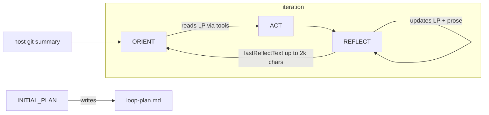

# Loop mode — handoff efficiency

Make iteration-to-iteration handoff cheaper in **tokens** and **wall-clock time** by treating progress state as **host-owned**, not model-maintained prose in the repo.

**Status:** Plan (not implemented)

**Related:** [loop-token-efficiency.plan.md](./loop-token-efficiency.plan.md), [loop-verb-models.plan.md](./loop-verb-models.plan.md), `src/domains/agents/worker/loop-run-flow.ts`, `config/loop.default.json`, `src/domains/agents/worker/workspace-setup.ts`

---

## Goal

Loop agents rotate OpenCode sessions each iteration. The only carried context is what the host injects plus whatever the model re-reads from disk. Today that is a **dual-channel** handoff:

1. **File ledger** — `.localagent-box/loop-plan.md` (markdown checklist), gitignored under `.localagent-box/`
2. **In-prompt replay** — full REFLECT output injected as `## Previous iteration summary` (capped at 2000 chars in `loop-run-flow.ts`)

Both channels duplicate the same facts in different shapes. ORIENT and REFLECT also pay **tool round-trips** to read/write the plan file.

Target architecture:

```
REFLECT → small structured output → host parses → updates state → host injects minimal slice → ORIENT
```

The model produces deltas; the host is the authority on progress.

---

## Current flow



### Already implemented (baseline)

| Item | Location |
|------|----------|
| ORIENT merged from OBSERVE + PLAN | `config/loop.default.json`, `LoopVerb` type |
| Session rotation per iteration | `loop-run-flow.ts` (`rotateSession`) |
| Framing only on first step of session | `buildOpenCodePrompt({ includeFraming: stepIndex === 0 })` |
| Templated REFLECT output (DONE / REMAINING / NEXT / FILES) | `config/loop.default.json` REFLECT prompt |
| Cap on injected REFLECT summary (2000 chars) | `MAX_INJECTED_SUMMARY_CHARS` in `loop-run-flow.ts` |
| Host git status + diffstat injection | `buildHostChangeSummary` in `workspace-setup.ts` |
| Stall detection (unchanged working tree) | `loop-run-flow.ts` |
| Soft max-iterations (commit partial work) | `failOnMaxIterations` in `loop.json` |

### Remaining pain

- **Redundant state:** plan file + REFLECT replay carry the same information.
- **Tool latency:** ORIENT reads plan; REFLECT writes plan — 1–3 extra tool turns per iteration.
- **Token cost:** full REFLECT prose re-sent even when plan file exists; model may re-read the whole plan via Read.
- **Unreliable ledger:** model may skip ticking items or fail to write the file after INITIAL_PLAN.
- **Repo coupling:** handoff lives in the clone; requires gitignore plumbing in `workspace-setup.ts`.

---

## Design principles

1. **One source of truth** — never inject the same fact twice (file + prose).
2. **Host reads, host writes** — deterministic I/O; model outputs structured text only.
3. **Inject slices, not documents** — unchecked milestones + one-line `NEXT`, not full plan + full REFLECT.
4. **Structured over markdown** — JSON (or agent-record fields) for machine handoff; markdown optional for human visibility.
5. **Prefer agent data dir over repo** — handoff state is runtime metadata, not product code.

---

## 1. Host-injected plan slice (phase 1 — highest ROI)

**Problem:** ORIENT uses a Read tool on `loop-plan.md`; the host also injects the previous REFLECT blob.

**Change:** On `stepIndex === 0` (first step after session rotation), the host reads the plan file and injects a compact block:

```markdown
## Plan (host-read)
- [ ] milestone 3
- [ ] milestone 4

NEXT (from last iteration): fix validation in src/foo.ts
```

**Rules:**

- Include only **unchecked** items (plus at most the last completed item for context).
- Parse `NEXT:` from the previous REFLECT output server-side; inject that one line instead of the full summary.
- When the plan file exists and is non-empty, **omit** `## Previous iteration summary` entirely.
- Fall back to capped REFLECT replay only when no plan file exists (e.g. `initialPlanPrompt` skipped).

**Touches:**

| File | Change |
|------|--------|
| `loop-run-flow.ts` | `readPlanSlice()`, conditional injection, drop redundant `previousIterationSummary` |
| `workspace-setup.ts` or new `loop-handoff.ts` | `readLoopPlanSlice(workspaceDir)`, `parseReflectTemplate(text)` |
| `loop-run-flow.test.ts` | injection when plan present vs absent |

**Expected impact:** −30–50% handoff input tokens; −1 tool turn per ORIENT.

---

## 2. Host-maintained ledger (phase 2)

**Problem:** REFLECT spends tool turns editing `loop-plan.md`; ticks are unreliable.

**Change:**

1. REFLECT prompt: output **only** the structured template + completion marker — **do not** edit the plan file.
2. Host parses REFLECT output (line-oriented parser for `DONE:` / `REMAINING:` / `NEXT:` / `FILES TOUCHED:`).
3. Host updates the ledger:
   - Tick milestones whose text appears in `DONE` (fuzzy match or explicit milestone ids in a later revision).
   - Store `next` and `lastFiles` in structured state.
4. Optional: REFLECT step uses OpenCode `plan` agent (read-only) since it no longer needs write tools.

**Touches:**

| File | Change |
|------|--------|
| `config/loop.default.json` | REFLECT prompt — remove "update loop-plan.md" instruction |
| `loop-handoff.ts` (new) | `parseReflectOutput`, `applyLedgerUpdate` |
| `loop-run-flow.ts` | call host update after REFLECT; pass parsed `next` into phase-1 injection |
| `session-orchestrator.ts` | per-step agent override (see loop-token-efficiency §3.2) |

**Expected impact:** −1–2 tool turns per iteration; more reliable handoff.

---

## 3. Structured state file (phase 3)

**Problem:** Markdown checklists are human-friendly but token-heavy and hard to parse reliably.

**Change:** Replace (or mirror) `loop-plan.md` with `.localagent-box/loop-state.json`:

```json
{
  "version": 1,
  "goal": "...",
  "milestones": [
    { "id": "m1", "text": "Add validation", "done": true, "verify": "npm test -- foo" },
    { "id": "m2", "text": "Wire API route", "done": false }
  ],
  "next": "Add POST handler in routes/foo.ts",
  "lastFiles": ["src/routes/foo.ts"],
  "iteration": 2
}
```

**INITIAL_PLAN:** prompt asks for JSON (or host converts first assistant output into this shape).

**Injection:** host sends only the next unfinished milestone + `next` (~50–100 tokens).

**Human visibility:** UI reads `loop-state.json` (or agent record) and renders a checklist; optional `loop-plan.md` export for debugging.

**Touches:**

| File | Change |
|------|--------|
| `loop-handoff.ts` | schema, read/write, slice builder |
| `config/loop.default.json` | INITIAL_PLAN / REFLECT prompts |
| `client/` (optional) | show milestone progress from agent API |

---

## 4. Move handoff out of the repo clone (phase 4)

**Problem:** `.localagent-box/` requires gitignore setup; handoff artifacts are conflated with the codebase.

**Change:** Store handoff state under agent runtime data, e.g. `{dataDir}/agents/{agentId}/loop-state.json`, alongside logs.

- `workspace-setup.ts` gitignore for `.localagent-box/` remains for `loop.json` / `config.json` repo overrides.
- Plan/ledger path resolved by `agentId`, not workspace path.

**Benefits:** no accidental commit risk; no model confusion about whether the file is product code; simpler cleanup on agent delete.

**Touches:**

| File | Change |
|------|--------|
| `loop-handoff.ts` | path resolution via `job.agentId` |
| `agent-state-writer.ts` | optional mirror of `next` / milestone counts on `AgentLoopState` for UI |
| `types/index.ts` | extend `AgentLoopState` with `handoff?: { next, remaining, ... }` |

---

## 5. Slim per-iteration injection (ongoing)

Extend the host-injected ground-truth block on iteration start (`stepIndex === 0`):

| Host injects | Replaces |
|--------------|----------|
| `git status --short` + diffstat totals (done) | model rediscovering "what changed" |
| Parsed `NEXT:` one-liner (phase 1–2) | full REFLECT prose |
| Unchecked milestones only (phase 1–3) | full plan file + Read tool |
| `iteration N of M` + stall warning when `noProgressStreak > 0` | repeated goal boilerplate |
| Check command exit + tail (from loop-token-efficiency §3.1) | REFLECT guessing test success |

**Plan-file verification** (from loop-token-efficiency §4.1 — not yet implemented):

After INITIAL_PLAN:

1. Assert ledger file exists and is non-empty.
2. If missing → retry once with a pointed prompt.
3. Still missing → host writes from raw assistant text (or seeds default milestones from goal).

Downstream prompts can drop "(when present)" hedging.

---

## 6. Session strategy (optional / later)

**Current:** fresh session per iteration → must re-inject all context.

**Option A — keep rotation, minimize injection (recommended):** rotation stays; injection is plan slice + git summary + `NEXT` only (phases 1–3). Lowest risk.

**Option B — synthetic restart:** after REFLECT, rotate session with a **single** synthetic first user message containing goal + plan slice + git summary + `NEXT` (no replay of tool history). Same token budget, cleaner than hoping the model re-reads files.

**Option C — long session with compaction:** one session across iterations; host summarizes and truncates history between iterations. Higher risk of context drift; only consider if rotation overhead dominates.

---

## 7. Speed and model tuning (parallel)

These complement handoff work and are partly available today:

| Item | Notes |
|------|-------|
| Per-verb models (`loopVerbModels`) | Small model for ORIENT/REFLECT, coder for ACT — already in Settings |
| Read-only agent for ORIENT | OpenCode `plan` agent — see loop-token-efficiency §3.2 |
| `checkCommand` after ACT | Host-run; gate `LOOP_COMPLETE` on exit 0 — see loop-token-efficiency §3.1 |
| Stall detection | Already implemented |
| Per-verb token telemetry | Identify which verb to shrink — loop-token-efficiency §3.4 |

---

## Source-of-truth comparison

| Approach | Input tokens | Speed | Human-visible | Complexity |
|----------|-------------|-------|---------------|------------|
| **Current (file + REFLECT replay)** | High | Slow (tool reads/writes) | Yes (md in clone) | Low |
| **Host-injected plan slice** | Medium | Faster (−1 Read/iter) | Yes | Low |
| **Host-maintained ledger** | Medium | Faster (−1–2 writes/iter) | Yes | Medium |
| **Structured JSON + agent data dir** | Low | Fastest | Via UI / optional export | Medium |
| **Agent-record fields only** | Lowest | Fastest | Via API/UI | Higher |

---

## Suggested implementation order

| Phase | Items | Primary files | Shippable alone? |
|-------|-------|---------------|------------------|
| **1** | Host-read plan slice; drop REFLECT replay when plan exists; parse `NEXT:` for injection | `loop-run-flow.ts`, `loop-handoff.ts` | Yes |
| **2** | Plan-file verification after INITIAL_PLAN | `loop-run-flow.ts`, `loop-handoff.ts` | Yes |
| **3** | Host-parse REFLECT template; host updates ledger; REFLECT stops editing file | `loop-handoff.ts`, `loop.default.json` | Yes |
| **4** | `checkCommand` + completion gating (from token-efficiency plan) | `repo-config.ts`, `loop-run-flow.ts` | Yes |
| **5** | `loop-state.json` schema + injection | `loop-handoff.ts`, prompts | Yes |
| **6** | Move state to agent data dir; extend `AgentLoopState` for UI | `agent-state-writer.ts`, `types/index.ts` | Yes |
| **7** | Per-step read-only agent for ORIENT | `session-orchestrator.ts`, `loop.default.json` | Yes |

Phase 1 alone should cut handoff tokens materially and remove one tool round-trip per iteration with minimal behavior change.

---

## Test plan

- **Unit:** `parseReflectOutput` — valid template, missing fields, completion marker, echo/negation cases (reuse `parseCompletionSignal` patterns).
- **Unit:** `readPlanSlice` — empty file, all done, partial checklist, missing file.
- **Unit:** injection logic — plan present → no `previousIterationSummary`; plan absent → capped fallback.
- **Integration:** mock loop run across 2 iterations — verify ORIENT prompt contains plan slice, not full REFLECT.
- **Integration:** INITIAL_PLAN retry + host seed when model omits file.
- **Regression:** completion signal on ORIENT and REFLECT still works; stall detection unchanged.

---

## Non-goals

- Full conversation summarization / LLM-based compaction between iterations (costly, non-deterministic).
- Partial merge of repo `loop.json` (v1 remains full replace).
- Committing handoff artifacts to the agent branch.
