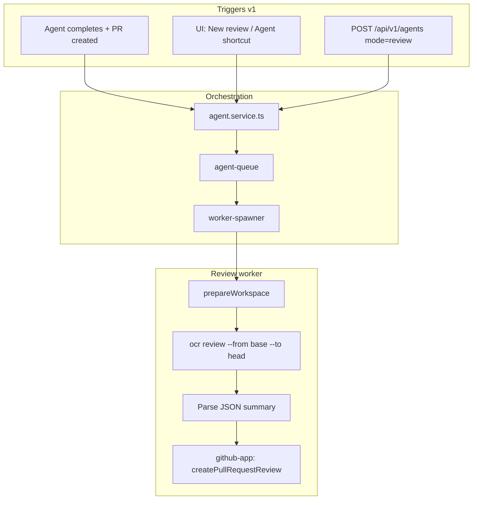

# PR code review — Open Code Review integration

Integrate [Open Code Review (OCR)](https://alibaba.github.io/open-code-review/#/docs) into localagent-box as a first-class **review agent mode**. Reviews run in an isolated workspace (same clone/checkout pipeline as coding agents), use the server's Ollama config, and post summary comments to GitHub when a matching PR exists.

**Status:** Phase 1 complete on `code-review-mode`. Auto-spawn after PR creation, review worker wiring, repo PUT tri-state, client types, Settings/Repositories UI, review session form, agent session shortcut, and tests are implemented. Phase 2 (webhooks) not started.

**Related:** [initial-build.plan.md](./initial-build.plan.md), [Open Code Review docs](https://alibaba.github.io/open-code-review/#/docs)

---

## Status board

| Item | Status | Notes |
|------|--------|-------|
| 1.1 Dependencies & packaging | **Done** | `Dockerfile` + `src/integrations/open-code-review/runner.ts` |
| 1.2 Types & config | **Done** | `AppConfig` / `Repo` / `AgentMode: 'review'` / `RepoPromptOverrides.reviewBackground` |
| 1.3 Repo settings API & UI | **Done** | `PUT /api/v1/repos/:repoId` tri-state; Repositories page inherit/on/off |
| 1.4 Review worker flow | **Done** | `review-run-flow.ts` with background merge, `headSha`, `githubReviewId`, warnings |
| 1.5 GitHub integration | **Done** | `findPullRequestByHead`, `createPullRequestReview` (COMMENT) |
| 1.6 Auto-spawn hook | **Done** | After `createPullRequest`, with dedup via `isDuplicateReview` |
| 1.7 API — create review session | **Done** | `mode: 'review'` defaults `useExistingBranch` + `headBranch` checkout |
| 1.8 UI | **Done** | Settings toggle + `reviewModel`; review mode in New Agent modal; session shortcut |
| 1.9 Failure semantics | **Done** | OCR fail → `failed`; GitHub fail → `completed` + `result.warning` |
| 2.x Webhook-driven reviews | **Not started** | No `POST /api/v1/webhooks/github` |
| Tests | **Done** | `resolve-auto-review`, `review-background`, `runner`, auto-spawn in `agent.service.test.ts` |

### Remaining tasks (Phase 2 only)

1. **GitHub webhook endpoint** — `POST /api/v1/webhooks/github` for `pull_request` `opened` / `synchronize`
2. **GitHub App config** — Register webhook URL; confirm PR read/write + Pull request events

---

## Decisions summary

| # | Decision |
|---|----------|
| 1 | **v1:** auto-review on agent-created PRs; **Phase 2:** GitHub webhooks for all PRs on registered repos |
| 2 | Global default + per-repo override (tri-state: inherit / on / off) |
| 3 | Shared LLM config from server settings; review runs in a full agent workspace (clone → checkout → OCR) |
| 4 | New agent mode: `review` (auto-spawn + manual) |
| 5 | Branch-range scope: `repoId` + `baseBranch` + `headBranch` (API-friendly) |
| 6 | Always post to GitHub when a matching PR exists; always store results on session |
| 7 | Summary review body on GitHub; findings posted as per-file/line PR review comments |
| 8 | Optional `background` on create; auto-spawn pre-fills from parent agent; repo preamble in `.localagent-box/config.json` |
| 9 | Separate `reviewModel` in Settings; falls back to `opencodeModel` |
| 10 | Global toggle default **off**; repo unset inherits global |
| 11 | UI: "New review session" form + "Review branches" shortcut on agent sessions |
| 12 | Auto-spawn skips if same PR + head SHA already reviewed; manual/API always runs |

---

## Architecture

Review sessions reuse the existing worker pipeline (`worker-spawner` → `agent-worker` → `prepareWorkspace`). The `review` run flow replaces OpenCode with OCR.

---

## Phase 1 — Core review mode — **Done**

See status board above for per-item notes. Key files:

| Area | Files |
|------|-------|
| **Integration** | `src/integrations/open-code-review/runner.ts` |
| **Worker** | `src/domains/agents/worker/review-run-flow.ts` |
| **Helpers** | `src/lib/review-background.ts`, `src/lib/resolve-auto-review.ts` |
| **Agents** | `agent.service.ts` (`maybeSpawnReviewAgent`), `agent.validation.ts`, `agent-worker.ts` |
| **GitHub** | `src/services/github-app.ts` |
| **Repos** | `routes/repos.ts`, `repo.service.ts` |
| **Client** | `SettingsPage.tsx`, `RepositoriesPage.tsx`, `AgentSessionsPage.tsx`, `AgentSessionPage.tsx`, `api/types.ts`, `api/repos.ts` |
| **Tests** | `resolve-auto-review.test.ts`, `review-background.test.ts`, `runner.test.ts`, `agent.service.test.ts` |

---

## Phase 2 — Webhook-driven reviews — **Not started**

### 2.1 GitHub App webhook endpoint

New route: `POST /api/v1/webhooks/github`

- Verify signature (GitHub App webhook secret)
- Handle `pull_request` events: `opened`, `synchronize`
- Filter: registered repo + `resolveAutoReviewPullRequests` enabled
- Dedup: same PR + head SHA as v1
- Spawn `review` agent with branches from webhook payload

### 2.2 GitHub App configuration

- Register webhook URL on the GitHub App
- Permissions: `Pull requests: Read & write`
- Events: `Pull request`

### 2.3 Dedup on `synchronize`

When PR branch is force-pushed (new head SHA), auto-review runs again — dedup allows this since SHA changed.

---

## Open items (defer, don't block v1)

- **Line-level review comments** — **Done** — findings with line numbers are posted on the diff; path-only findings use file-level comments
- **Review verdict** (`REQUEST_CHANGES` / `APPROVE`) — policy decision for later
- **`ocr viewer` WebUI** — optional embed for browsing session logs
- **Custom OCR `rule.json` per repo** — via `.localagent-box/review-rules.json` if needed
- **Concurrency limits** — cap simultaneous review workers if cost becomes an issue
- **docs/repo-config.md** — document `reviewBackground` key
