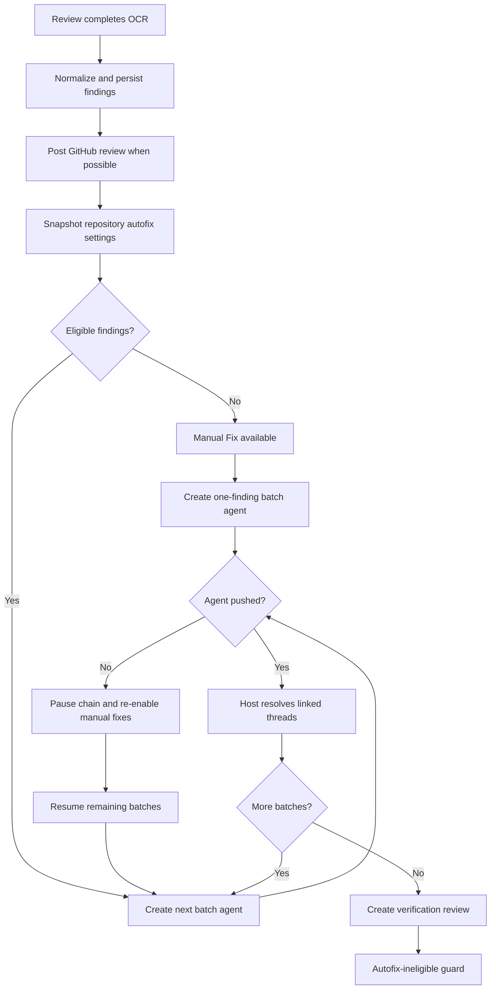

# Review findings autofix

Add host-orchestrated autofix support to review sessions. Eligible findings are grouped into sequential batch-agent runs according to repository settings. Every finding remains individually fixable from a structured review table, including findings below the automatic severity threshold.

**Status:** Planned

**Related:** [pr-code-review.plan.md](./pr-code-review.plan.md), `src/domains/agents/worker/review-run-flow.ts`, `src/domains/agents/agent.service.ts`

---

## Goals

1. Store review findings as structured, addressable records instead of treating review markdown as the only UI representation.
2. Automatically fix findings at or above a repository severity threshold.
3. Limit the number of findings assigned to one batch agent and process larger reviews sequentially.
4. Allow any unassigned finding to be fixed manually.
5. Resolve linked GitHub review threads after a fix agent successfully pushes.
6. Run one verification review after a group of fix agents finishes without creating a review–fix loop.
7. Keep coding agents focused on code; orchestration and GitHub operations remain host responsibilities.

## Non-goals for v1

- Selecting multiple findings for an ad hoc manual batch.
- Determining whether each finding was actually fixed by inspecting agent output.
- Automatically retrying a failed fix batch.
- More than one autofix cycle from the same review chain.
- Giving GitHub credentials or comment-resolution responsibilities to coding agents.
- Adding global autofix defaults. Both autofix settings are repository-specific.

---

## Decisions

| Area | Decision |
|------|----------|
| Automatic scope | Include known severities at or above the configured inclusive threshold |
| Unknown severity | Never automatic; Manual Fix remains available |
| Repository default | Autofix disabled |
| Batch size | Repository setting, default `5`, valid range `1–20` |
| Ordering | `critical`, `high`, `medium`, `low`; preserve OCR order within a severity |
| Batch execution | Normal batch agents, one automatic batch at a time |
| Model | Repository's normal batch-agent model and prompt overrides |
| Checkout | Always use the latest reviewed head branch state |
| Agent context | Only assigned structured findings and required task instructions |
| Success rule | Any successful push means every finding assigned to that agent is fixed |
| GitHub resolution | Host resolves linked threads after a successful push |
| Resolution failure | Keep coding session successful; expose Retry Resolution |
| Batch failure/no push | Pause automatic chain; do not create later batches automatically |
| Resume behavior | Skip the failed batch, expose its findings for manual fix, continue later batches |
| Verification | One autofix-ineligible review after the fix queue drains |
| Manual verification | Coalesce multiple manual fixes into one verification review |
| Stale finding | Warn when reviewed SHA differs from current head, but permit manual fix |
| Non-PR review | Autofix still works; GitHub resolution is not applicable |
| GitHub post failure | Autofix still works from persisted OCR findings |
| Settings changes | Affect future reviews only; an existing review uses its settings snapshot |
| UI filtering | Client-side severity, category, and fix-status filters |

---

## User-visible behavior

### Repository settings

The repository settings page gains:

- **Autofix severity**
  - Disabled
  - Critical
  - High and above
  - Medium and above
  - Low and above
- **Maximum findings per autofix batch**
  - Integer from 1 through 20
  - Defaults to 5

The batch-size control may remain enabled while autofix is disabled so a user can configure both fields before enabling it.

### Review session

Completed review sessions display a findings table instead of embedding all findings only in a markdown transcript.

Columns:

1. Severity
2. Category
3. Finding
4. Location
5. GitHub thread
6. Fix status
7. Action

Each row expands to show:

- Full explanation
- Existing code, when provided by OCR
- Suggested code, when provided by OCR
- Reviewed head SHA
- GitHub comment link, when available
- Linked fix-agent session and its current status
- Resolution error, when resolution failed

Filters:

- Severity
- Category
- Fix status

Filtering is client-side because the complete findings result is already loaded. The default ordering is highest severity first, preserving OCR order for equal severities.

### Manual Fix action

Manual Fix is available for every finding that is not already assigned to a queued or running fix agent. This includes:

- Findings below the automatic threshold
- Missing or unknown severities
- Findings without a file or line
- Findings without a GitHub thread
- Findings from reviews not linked to a PR
- Stale findings produced from an older branch SHA

While a finding has a queued or running fix agent:

- Disable Manual Fix.
- Display the linked agent status.
- Link to the agent session.

If the agent fails or finishes without pushing:

- Re-enable Manual Fix.
- Leave the GitHub thread unresolved.

If the reviewed SHA no longer matches the current branch head, display a stale-context warning. The action remains enabled and the fix agent checks out the latest branch head.

### Automatic chain

Example with 12 eligible findings and a batch size of 5:

1. Create batch agent for findings 1–5.
2. Wait for it to finish.
3. If it pushes successfully, resolve linked threads and create batch agent for findings 6–10.
4. Wait for it to finish.
5. If it pushes successfully, resolve linked threads and create batch agent for findings 11–12.
6. After the final successful push, create one verification review.

Only one automatic batch agent is created at a time. Do not enqueue every batch up front. This makes pausing deterministic and avoids queued work continuing after an earlier failure.

If a batch fails or completes without a push:

1. Mark its findings failed and manually fixable.
2. Pause the automatic chain.
3. Leave later batches pending and uncreated.
4. Display **Resume Remaining Batches**.
5. On resume, skip the failed batch and create the next pending batch.

### Verification review

After all automatic batches succeed, create exactly one verification review for the latest branch head.

For manual fixes, wait until all currently queued or running autofix-related agents on the branch have drained, then create one verification review. Multiple manual clicks should not create one review each.

Verification reviews:

- Use normal review behavior and display their findings.
- Are explicitly marked autofix-ineligible.
- Must not start another automatic fix chain.
- Still allow individual Manual Fix actions.

---

## Architecture



Use the existing agent queue and worker pipeline. Fix agents remain `mode: 'batch'`; this feature does not add another worker type.

---

## Persisted types

Place shared server types in `src/types/index.ts`. Mirror client-facing types in `client/src/api/types.ts`.

### Repository settings

```ts
export type AutofixSeverityThreshold =
  | 'disabled'
  | 'critical'
  | 'high'
  | 'medium'
  | 'low';

export interface RepoAutofixSettings {
  severityThreshold: AutofixSeverityThreshold;
  maxFindingsPerBatch: number;
}
```

Existing repository records may omit these fields. Normalize missing values to:

```ts
{
  severityThreshold: 'disabled',
  maxFindingsPerBatch: 5,
}
```

Do not require a one-off migration.

### Finding record

Persist findings in the review agent directory as `review-findings.json`.

```ts
export type ReviewFindingFixStatus =
  | 'available'
  | 'assigned'
  | 'fixing'
  | 'fixed'
  | 'failed';

export type ReviewFindingResolutionStatus =
  | 'not_applicable'
  | 'pending'
  | 'resolved'
  | 'failed';

export interface ReviewFindingRecord {
  id: string;
  ordinal: number;
  severity: 'critical' | 'high' | 'medium' | 'low' | 'unknown';
  category: string | null;
  path: string | null;
  startLine: number | null;
  endLine: number | null;
  content: string;
  existingCode: string | null;
  suggestionCode: string | null;
  reviewedSha: string | null;
  fixStatus: ReviewFindingFixStatus;
  assignedAgentId: string | null;
  fixedAt: string | null;
  github: {
    reviewId: string | null;
    commentId: number | null;
    commentUrl: string | null;
    threadId: string | null;
    resolutionStatus: ReviewFindingResolutionStatus;
    resolutionError: string | null;
    resolvedAt: string | null;
  };
}
```

Generate IDs deterministically within one review:

```text
<reviewAgentId>:finding:<zero-based OCR ordinal>
```

The ID only needs to remain stable for that review. A verification review creates new finding IDs.

### Autofix plan

Persist orchestration state as `review-autofix-plan.json`.

```ts
export interface ReviewAutofixSnapshot {
  severityThreshold: AutofixSeverityThreshold;
  maxFindingsPerBatch: number;
  reviewedSha: string | null;
  baseBranch: string;
  headBranch: string;
  prNumber: number | null;
  snapshottedAt: string;
}

export interface AutofixBatchPlan {
  index: number;
  findingIds: string[];
  agentId: string | null;
  status: 'pending' | 'queued' | 'running' | 'completed' | 'failed' | 'skipped';
}

export interface ReviewAutofixPlan {
  schemaVersion: 1;
  snapshot: ReviewAutofixSnapshot;
  chainStatus: 'disabled' | 'running' | 'paused' | 'completed';
  batches: AutofixBatchPlan[];
  nextBatchIndex: number | null;
  verification: {
    status: 'none' | 'pending' | 'queued' | 'running' | 'completed' | 'failed';
    agentId: string | null;
  };
}
```

Use atomic file replacement when changing finding or plan state so a server interruption does not leave partially written JSON.

### Agent metadata

Add metadata to fix agents:

```ts
export interface AgentAutofixMetadata {
  kind: 'automatic' | 'manual';
  sourceReviewAgentId: string;
  findingIds: string[];
  batchIndex?: number;
}
```

Extend review metadata:

```ts
purpose?: 'standard' | 'verification';
sourceReviewAgentId?: string;
autofixIneligible?: boolean;
```

Use `autofix.sourceReviewAgentId` as the canonical fix-to-review relationship. Do not overload the existing review agent's `parentAgentId` relationship, which already points at the coding agent that caused the review.

---

## Severity selection and batching

Create `src/lib/review-findings.ts` with pure functions. Keep policy out of the worker flow so it is easy to test.

Required exports:

```ts
normalizeReviewFindings(reviewAgentId, ocrResult, reviewedSha)
isFindingAutoEligible(finding, threshold)
sortFindingsForAutofix(findings)
splitFindingsIntoBatches(findings, maxFindingsPerBatch)
```

Severity rank:

```ts
const SEVERITY_RANK = {
  critical: 4,
  high: 3,
  medium: 2,
  low: 1,
};
```

Rules:

1. `disabled` selects nothing.
2. Unknown or missing severity selects nothing.
3. A finding is eligible when its rank is greater than or equal to the selected threshold rank.
4. Sort by descending severity rank.
5. For equal ranks, sort by original OCR ordinal.
6. Validate batch size at repository API boundaries.
7. Defensively clamp or default persisted invalid values when loading old or manually edited data.

---

## GitHub comment capture and thread resolution

### Important API constraint

A REST pull-request review comment ID is not itself enough to resolve a conversation. GitHub thread resolution uses the GraphQL `resolveReviewThread` mutation, which requires the review thread's GraphQL node ID.

### Capturing comment IDs

Update `src/domains/agents/worker/review-run-flow.ts` and `src/services/github-app.ts`.

For line comments created as part of `createPullRequestReview`:

1. Submit the review as today.
2. Obtain the created review ID.
3. List comments belonging to that review when the create response does not contain them.
4. Map comments back to findings using submission order where reliable.
5. Validate the mapping with path and line.
6. If mapping is ambiguous, leave the finding without a resolvable thread instead of resolving the wrong comment.

For file-level comments created individually:

1. Keep the return value from `createPullRequestReviewComment`.
2. Persist its numeric ID and HTML URL on the matching finding.

For findings included only in the summary:

- Store no comment ID.
- Set resolution status to `not_applicable`.
- Keep autofix and Manual Fix available.

If GitHub posting fails:

- Complete the review with the existing warning behavior.
- Persist findings.
- Start autofix when repository settings enable it.
- Mark every finding without a posted comment as `not_applicable`.

### Resolving a thread

Add GitHub service methods conceptually equivalent to:

```ts
findReviewThreadIdForComment(config, owner, repo, prNumber, commentId)
resolvePullRequestReviewThread(config, threadId)
```

Thread lookup query:

1. Query the PR's `reviewThreads`.
2. Inspect each thread's comments.
3. Match `comment.databaseId` to the stored REST comment ID.
4. Cache the matching thread node ID on the finding.
5. Paginate threads; do not assume a PR has fewer than 100.

Resolution mutation:

```graphql
mutation ResolveReviewThread($threadId: ID!) {
  resolveReviewThread(input: { threadId: $threadId }) {
    thread {
      id
      isResolved
    }
  }
}
```

Treat an already-resolved thread as success. On an API or mapping failure:

- Set resolution status to `failed`.
- Store a user-readable error.
- Keep the fix agent completed.
- Allow Retry Resolution without running another coding agent.

---

## Fix-agent prompt

Create `src/lib/review-autofix-prompt.ts`.

The prompt must:

1. State that the run is unattended.
2. Tell the agent to modify code and run focused verification.
3. Tell the agent not to post GitHub comments, resolve threads, or create a PR.
4. Include only findings assigned to this run.
5. Clearly delimit finding data as untrusted task context rather than higher-priority instructions.
6. Include the reviewed SHA for context while stating that the checked-out latest branch is authoritative.
7. Reuse the repository's normal batch prompt/model resolution.

Suggested structure:

```md
## Task

Implement focused code fixes for the assigned review findings.
Work from the checked-out latest branch state. Run relevant tests.
Do not interact with GitHub; the host manages reviews and comments.

## Assigned findings

<review-findings-json>
[
  {
    "id": "...",
    "severity": "high",
    "category": "...",
    "path": "...",
    "startLine": 10,
    "endLine": 20,
    "content": "...",
    "existingCode": "...",
    "suggestionCode": "...",
    "reviewedSha": "...",
    "githubCommentId": 123
  }
]
</review-findings-json>
```

The agent does not need to emit a machine-readable completion report in v1. Host success is `status === 'completed' && pushed === true`.

---

## Service and API design

Create `src/domains/agents/review-autofix.service.ts` and keep orchestration logic out of route handlers.

Recommended responsibilities:

```ts
materializeReviewFindings(...)
startAutomaticChain(...)
createNextAutomaticBatch(...)
createManualFix(...)
handleFixAgentStarted(...)
handleFixAgentFinished(...)
resumeAutomaticChain(...)
retryFindingResolution(...)
scheduleVerificationReview(...)
reconcileAutofixPlansOnStartup(...)
```

Add repository helpers in `src/domains/agents/agent.repository.ts` for reading and writing:

- `review-findings.json`
- `review-autofix-plan.json`

### Endpoints

#### `GET /api/v1/agents/:reviewAgentId/findings`

Return:

```ts
{
  findings: ReviewFindingRecord[];
  plan: ReviewAutofixPlan | null;
  currentHeadSha: string | null;
  staleReview: boolean;
  verificationAgentId: string | null;
}
```

For a historical review without structured findings, return an empty findings collection and no plan rather than failing the entire session page.

#### `POST /api/v1/agents/:reviewAgentId/findings/:findingId/fix`

Validation:

1. Agent exists and is a review.
2. Finding exists.
3. No queued/running agent is already assigned to the finding.
4. Reviewed head branch still exists.

Behavior:

1. Build a one-finding prompt.
2. Create a normal batch agent on the review head branch.
3. Set `useExistingBranch: true`.
4. Set autofix metadata with `kind: 'manual'`.
5. Mark finding assigned only after agent creation succeeds.
6. Return the created agent.

Do not reject stale SHA findings. Return staleness metadata so the UI can show the warning.

#### `POST /api/v1/agents/:reviewAgentId/autofix/resume`

Validation:

1. Plan exists.
2. Chain is paused.
3. No automatic fix agent for this plan is active.
4. A later pending batch exists.

Behavior:

1. Mark failed batch skipped if not already skipped.
2. Keep its findings manually fixable.
3. Set chain to running.
4. Create the next pending batch.

Make the endpoint idempotent enough to reject duplicate clicks with a conflict response rather than creating duplicate agents.

#### `POST /api/v1/agents/:reviewAgentId/findings/:findingId/retry-resolution`

Validation:

1. Finding is marked fixed.
2. It has a GitHub comment ID or cached thread ID.
3. Resolution is pending or failed.

Behavior:

1. Resolve through the host GitHub service.
2. Update finding state.
3. Never create a coding agent.

---

## Queue and lifecycle integration

### Review completion

Integrate near the end of `runReviewJob` in `src/domains/agents/worker/review-run-flow.ts`.

Required ordering:

1. OCR succeeds and `review-result.json` is written.
2. Normalize structured findings.
3. Attempt GitHub posting and attach any resulting comment IDs.
4. Load and snapshot current repository autofix settings.
5. Persist findings and autofix plan.
6. Complete the review agent record.
7. Start the first automatic batch when eligible.

Autofix must not depend on GitHub posting success.

### Creating automatic batches

Do not create every batch agent at review completion.

`createNextAutomaticBatch`:

1. Acquire or enforce a plan-level mutation guard.
2. Reload the latest plan from disk.
3. Confirm chain is running.
4. Find `nextBatchIndex`.
5. Confirm no batch for that index already has an agent ID.
6. Build the prompt.
7. Create one batch agent.
8. Persist the agent ID and queued status.
9. Mark its findings assigned.

The existing branch queue serialization remains the final protection against concurrent workers on the same branch.

### Worker start and exit

Extend the central worker lifecycle handling in `src/domains/agents/agent.service.ts`.

When an autofix agent starts:

- Change its assigned findings from `assigned` to `fixing`.
- Change its batch status to `running`.

When it completes and `pushed === true`:

1. Mark all assigned findings fixed.
2. Attempt host-side GitHub resolution for each linked finding.
3. Keep resolution failures separate from coding success.
4. For an automatic batch:
   - Mark batch completed.
   - Create the next pending batch, or schedule verification if none remain.
5. For a manual fix:
   - Schedule verification only after related branch fix work drains.

When it fails, is cancelled, or completes without a push:

1. Mark assigned findings failed but manually actionable.
2. Do not resolve GitHub threads.
3. For an automatic batch:
   - Mark the batch failed.
   - Pause the chain.
   - Do not create the next batch.
4. For a manual fix:
   - Re-enable its Manual Fix action.

### Preventing duplicate normal reviews

The current completion flow may find or create a PR and call `maybeSpawnReviewAgent`. An autofix push must not create both:

- A normal auto-review through the existing PR path, and
- The explicit coalesced verification review.

Add a guard so agents with autofix metadata do not trigger the ordinary auto-review spawn. Verification scheduling is the only review trigger for autofix agents.

### Queue predecessor handling

Fix agents operate on an existing pushed PR branch. Review `findCodingPredecessor` and `predecessorAllowsStart` in `src/domains/agents/queue-eligibility.ts`.

Expected behavior:

- A fix agent waits for any currently active worker on the same repository branch.
- It should not remain blocked by the original coding agent once the review has already run against the pushed branch.
- Automatic batches remain sequential because only the next batch is created after the prior batch exits.

Add explicit tests before changing predecessor rules. Avoid weakening queue ordering for unrelated batch agents.

---

## Verification review scheduling

Create one helper that schedules verification reviews for both automatic and manual fixes.

Inputs:

- Source review agent ID
- Repository ID
- Base branch
- Head branch
- Trigger: automatic chain or manual drain

Before creating a verification review:

1. Confirm no fix agent related to the source review is queued or running.
2. Confirm no fix agent on the same branch that should be coalesced is queued or running.
3. Confirm the plan does not already have a queued/running/completed verification review for the final head SHA.
4. Create a review agent with:
   - `purpose: 'verification'`
   - `autofixIneligible: true`
   - `sourceReviewAgentId`
5. Persist the new review agent ID before allowing another scheduler invocation.

Every path that starts autofix must check `autofixIneligible`. This is the primary infinite-loop guard.

Manual Fix remains available on verification-review findings. A manual fix from a verification review may itself schedule another autofix-ineligible verification review, but it must never automatically create fix batches.

---

## Detailed implementation phases

Each phase should be independently testable. Do not begin UI actions before the supporting server state and API exist.

### Phase 1 — Repository settings and pure finding policy

**Objective:** Add repository configuration and thoroughly tested pure functions without changing runtime review behavior.

Tasks:

1. Add autofix threshold and batch-size types to `src/types/index.ts`.
2. Extend repository persistence and normalization so old records receive disabled/5 defaults.
3. Extend repository update validation:
   - Accept only known threshold strings.
   - Accept integer batch sizes from 1 through 20.
   - Reject invalid values with the existing validation error pattern.
4. Extend `PUT /api/v1/repos/:repoId`.
5. Mirror types and request fields in the client API.
6. Add controls to `client/src/pages/RepositoriesPage.tsx`.
7. Create `src/lib/review-findings.ts`.
8. Unit test normalization, inclusive thresholds, unknown severities, ordering, and chunking.

Acceptance checks:

- Existing repository JSON loads without migration.
- A new repository reports autofix disabled and batch size 5.
- Updating only one autofix setting preserves the other.
- High selects critical and high, but not medium or low.
- Twelve findings split into 5/5/2.
- Unknown severity never appears in automatic batches.

Suggested tests:

- New `src/lib/review-findings.test.ts`
- Existing repository service/route tests
- Client type-check/build

### Phase 2 — Persist structured findings and render the table

**Objective:** Produce first-class findings for new reviews and display them read-only.

Tasks:

1. Add finding persistence types.
2. Add `review-findings.json` repository helpers.
3. Normalize findings after OCR succeeds.
4. Preserve original OCR ordinal before severity sorting.
5. Add `GET /api/v1/agents/:reviewAgentId/findings`.
6. Return empty structured state for historical review agents.
7. Add client fetch/types.
8. Create `ReviewFindingsTable.tsx`.
9. Add expandable details and client-side filters.
10. Keep raw review/session output available in the existing transcript for diagnostics.

Acceptance checks:

- New review sessions show one table row per normalized OCR finding.
- Missing path, line, severity, category, or suggestion does not break rendering.
- Historical reviews still load.
- Filtering does not request additional server data.
- Default sorting is severity-first and stable within each severity.

Suggested tests:

- Finding normalization unit tests
- Agent repository artifact tests
- Agent findings route tests
- Component tests for filter/sort helpers, if the client test setup supports them
- `npm`/client type-check and build

### Phase 3 — Capture GitHub comments and implement resolution

**Objective:** Reliably link findings to review comments and resolve their threads from the host.

Tasks:

1. Preserve return values from individually created file comments.
2. Add listing/mapping support for comments created in a submitted review.
3. Persist comment IDs and URLs on findings.
4. Add GraphQL request support using the existing GitHub App installation token.
5. Add paginated thread lookup by REST comment database ID.
6. Add idempotent thread resolution.
7. Add Retry Resolution service method and endpoint.
8. Expose resolution state and action in the table.

Acceptance checks:

- Line and file comments map to the intended finding.
- Ambiguous mappings are not guessed.
- Summary-only and non-PR findings report `not_applicable`.
- Already-resolved threads are treated as success.
- Resolution errors are persisted and retryable.

Suggested tests:

- Extend `src/services/github-app.test.ts`
- Add review-run-flow comment mapping tests
- Route/service tests for Retry Resolution

### Phase 4 — Manual single-finding fixes

**Objective:** Deliver the simplest end-to-end fixing path before automatic orchestration.

Tasks:

1. Add autofix metadata to batch agents.
2. Create the fix prompt builder.
3. Add the manual-fix endpoint.
4. Create batch agents with:
   - Latest head branch
   - `useExistingBranch: true`
   - One finding ID
   - Normal batch model and repository prompt overrides
5. Update finding state when the worker starts and exits.
6. On successful push, mark the finding fixed and resolve its thread.
7. On failure/no push, re-enable Manual Fix.
8. Disable duplicate requests while an assigned agent is active.
9. Link table rows to fix-agent sessions.
10. Add stale-SHA warning without blocking the action.

Acceptance checks:

- One click creates exactly one batch agent.
- A second click while it is active returns conflict and creates nothing.
- The agent starts from current branch head.
- Successful push marks the finding fixed.
- Failed/no-change run makes the finding actionable again.
- GitHub resolution failure does not change coding-agent success.

Suggested tests:

- New `review-autofix.service.test.ts`
- Extend `agent.service.test.ts` for worker exit behavior
- Extend queue eligibility tests for the existing branch
- Client action-state tests where practical

### Phase 5 — Automatic plans and sequential batching

**Objective:** Automatically process eligible findings while retaining explicit pause semantics.

Tasks:

1. Add plan persistence and settings snapshot.
2. Materialize the complete batch plan at review completion.
3. Skip plan startup for disabled or autofix-ineligible reviews.
4. Create only the first batch agent.
5. On successful push, create only the next batch.
6. On failure/no push, pause the plan.
7. Add Resume Remaining Batches.
8. On resume, skip the failed batch and continue with the next pending batch.
9. Show chain and batch status on the review session.
10. Ensure settings changes do not recalculate an existing plan.

Acceptance checks:

- Eligible findings use snapshotted settings.
- Only one automatic batch agent exists at a time.
- A failed second batch prevents creation of the third.
- Resume does not retry the second batch.
- Findings from the failed batch are manually actionable.
- Duplicate resume requests cannot create duplicate agents.

Suggested tests:

- Plan serialization and transition unit tests
- Service test with 12 findings and size 5
- Failure on batch 2 followed by resume into batch 3
- Restart/reload test using a persisted paused plan

### Phase 6 — Verification reviews and loop prevention

**Objective:** Verify pushed fixes exactly once after related work drains.

Tasks:

1. Extend review metadata with verification purpose and source review ID.
2. Add verification scheduler and dedup checks.
3. Trigger verification after the last successful automatic batch.
4. Coalesce manual fixes into one review after branch-related fix agents drain.
5. Prevent autofix agents from triggering the existing ordinary auto-review path.
6. Reject automatic chain startup for verification reviews.
7. Display the linked verification review from the source session.

Acceptance checks:

- Three successful automatic batches produce one verification review.
- Several manual fix clicks produce one verification review after all finish.
- Verification review findings never start an automatic fix chain.
- No normal auto-review races with the explicit verification review.
- Manual Fix remains available on verification findings.

Suggested tests:

- Service tests for automatic and manual scheduling
- Agent service tests for ordinary auto-review suppression
- Dedup tests by source review and final head SHA
- End-to-end mocked lifecycle test proving the chain terminates

### Phase 7 — Recovery, documentation, and final polish

**Objective:** Make persisted orchestration safe across restart and understandable to operators.

Tasks:

1. Reconcile plans during server startup:
   - Queued agent still exists: retain assignment.
   - Running status with no live worker: derive outcome from agent record.
   - Missing agent record: mark batch failed and pause.
2. Ensure finding/plan writes are atomic.
3. Improve UI loading, empty, conflict, and error states.
4. Document GitHub App permissions and GraphQL resolution behavior.
5. Update `docs/code-review.md`.
6. Add structured logs containing review ID, batch index, finding IDs, and fix agent ID.
7. Run the full focused server and client verification suites.

Acceptance checks:

- Restart does not duplicate fix agents.
- An interrupted plan becomes safely paused or resumes its existing queued agent.
- Existing review mode behavior is unchanged when autofix is disabled.
- GitHub failures remain warnings and do not lose findings.

---

## Test matrix

| Scenario | Expected result |
|----------|-----------------|
| Autofix disabled | No batch agents; every finding manually actionable |
| Threshold high | Critical and high selected |
| Unknown severity | Manual only |
| 12 findings, size 5 | Three planned batches: 5/5/2 |
| First batch pushes | Findings fixed, threads resolved, second batch created |
| First batch no changes | Chain paused, findings manually actionable |
| Resume paused chain | Failed batch skipped, next batch created |
| Resolution API fails | Agent successful, finding fixed, resolution failed |
| Retry resolution succeeds | Resolution becomes resolved; no coding agent |
| GitHub posting fails | Findings persist and autofix proceeds without resolution |
| Review has no PR | Autofix proceeds; resolution not applicable |
| Manual duplicate click | One agent only; second request conflicts |
| Branch head changed | Warning displayed; manual fix uses latest head |
| Several manual fixes | One verification review after drain |
| Verification review finds issues | Table and Manual Fix available; no automatic chain |
| Settings change mid-chain | Existing snapshot and batches unchanged |
| Server restarts mid-chain | Existing agent reconciled; no duplicate creation |

---

## Likely files

### Server

- `src/types/index.ts`
- `src/domains/repos/repo.service.ts`
- `src/domains/repos/repo.repository.ts`
- `src/routes/repos.ts`
- `src/domains/agents/agent.repository.ts`
- `src/domains/agents/agent.service.ts`
- `src/domains/agents/agent.validation.ts`
- `src/domains/agents/queue-eligibility.ts`
- `src/domains/agents/worker/review-run-flow.ts`
- `src/domains/agents/worker/batch-run-flow.ts`
- `src/services/github-app.ts`
- `src/routes/agents.ts`
- New `src/lib/review-findings.ts`
- New `src/lib/review-autofix-prompt.ts`
- New `src/domains/agents/review-autofix.service.ts`

### Client

- `client/src/api/types.ts`
- `client/src/api/agents.ts` or new `client/src/api/review-findings.ts`
- `client/src/pages/RepositoriesPage.tsx`
- `client/src/pages/AgentSessionPage.tsx`
- New `client/src/components/agents/ReviewFindingsTable.tsx`

### Tests

- New `src/lib/review-findings.test.ts`
- New `src/domains/agents/review-autofix.service.test.ts`
- `src/domains/agents/agent.service.test.ts`
- `src/domains/agents/queue-eligibility.test.ts`
- `src/domains/agents/worker/review-run-flow.test.ts`
- `src/services/github-app.test.ts`

---

## Implementation invariants

These conditions must remain true throughout implementation:

1. Autofix disabled means no behavior change for existing review sessions.
2. A finding has at most one active fix agent.
3. An automatic plan has at most one active automatic batch agent.
4. Only a successful push marks assigned findings fixed.
5. Only the host performs GitHub operations.
6. GitHub resolution failure never changes coding-agent success.
7. Unknown severities never enter automatic batches.
8. Verification reviews never start automatic fix chains.
9. A source review and final branch head produce at most one active verification review.
10. Persist the agent relationship before exposing an assigned state that cannot be recovered.
11. Never resolve an ambiguously mapped GitHub comment.
12. Historical reviews and repositories remain readable without migration.

---

## Completion checklist

- [ ] Repository settings persist, validate, and render
- [ ] Severity policy and batching helpers have unit coverage
- [ ] Structured findings persist for every successful OCR review
- [ ] Review table supports expansion and client-side filters
- [ ] GitHub comment IDs map safely to findings
- [ ] Host can resolve and retry review-thread resolution
- [ ] Manual Fix creates one normal batch agent
- [ ] Duplicate manual fixes are blocked
- [ ] Automatic plan creates batches sequentially
- [ ] Failure/no push pauses the plan
- [ ] Resume skips failed work and continues later batches
- [ ] Successful pushes resolve assigned linked threads
- [ ] Manual and automatic fixes coalesce verification correctly
- [ ] Verification reviews are autofix-ineligible
- [ ] Existing ordinary auto-review does not race verification
- [ ] Startup reconciliation cannot duplicate agents
- [ ] Focused server tests pass
- [ ] Client type-check/build passes
- [ ] Review documentation is updated
