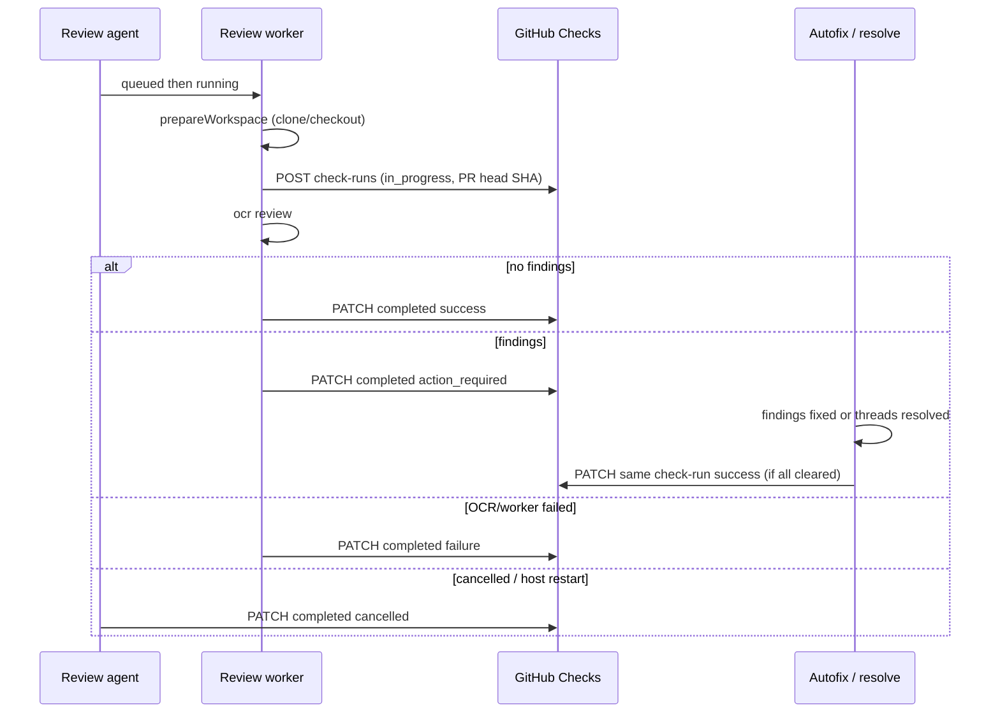

# Review GitHub Checks integration

Report each localagent-box review as a GitHub **check run** on the PR head SHA. Operators can add `localagent-box / review` as a required status check. Existing PR review comments stay as they are; checks are additive.

**Status:** Done

**Related:** [pr-code-review.plan.md](./pr-code-review.plan.md), [code-review.md](../code-review.md), [github-app-setup.md](../github-app-setup.md)

---

## Decisions (locked)

| Area | Decision |
|------|----------|
| API | GitHub **Checks API** (`check-runs`), not Commit Statuses |
| Check name | Stable `localagent-box / review` for every review, including verification |
| Create when | Start of `runReviewJob`, **before OCR**, after workspace prepare |
| Head SHA | Matching PR’s `head.sha` (skip the check if no open/matching PR) |
| No findings | Complete with `conclusion: success` |
| Has findings | Complete with `conclusion: action_required` |
| Later flip | PATCH the **same** check run to `success` when every finding on that review is locally `fixed` **or** its GitHub thread is `resolved` |
| New commits | Autofix pushes change the merge gate. The next review (usually verification) creates a **new** check on the new SHA. Updating the old SHA’s check is still done for history. |
| OCR / worker failure | `conclusion: failure` |
| Cancel / interrupted job | `conclusion: cancelled` |
| GitHub check errors | Non-fatal warnings; the review still completes locally (same as today’s review-post behavior) |
| Stuck `in_progress` | Host startup reconciliation cancels checks for reviews marked failed/cancelled after restart |
| Settings toggle | None. Always create a check when a matching PR exists, same as posting the PR review |
| Annotations / `details_url` | Out of scope. Line comments already exist; the UI is typically localhost |

---

## Why Checks (not Statuses)

The GitHub Checks API is what the PR “Checks” UI and required status checks use for GitHub Apps.

There is no `completed` + `pending` pair:

| Checks field | Values that matter here |
|--------------|-------------------------|
| `status` | `queued` → `in_progress` → `completed` |
| `conclusion` (only when `status=completed`) | `success`, `failure`, `cancelled`, `action_required`, … |

`pending` is a **Commit Statuses** state. `action_required` is the Checks equivalent of “done reviewing, needs attention.” GitHub Apps can PATCH a completed check run later, which is how findings-resolved → `success` works.

---

## Current gap

Today a review:

1. Clones and checks out `headBranch` (`prepareWorkspace`)
2. Runs OCR
3. Looks up the PR with `findPullRequestByHead`
4. Posts a `COMMENT` review plus line/file comments
5. Stores `githubReviewId` on `AgentReviewMetadata`

There is **no** check-run create/update. The GitHub App is granted **Contents** + **Pull requests** only — not **Checks**.

PR lookup happens *after* OCR, so a check cannot appear “when the review starts” without moving that lookup earlier.

---

## Lifecycle



Check runs are **per commit SHA**. Required checks look at the **current PR head**. Flipping SHA1’s check to `success` does not green-merge SHA2; the verification review’s new check on SHA2 does.

---

## GitHub App (ops)

Add repository permission:

| Permission | Access | Why |
|------------|--------|-----|
| **Checks** | Read and write | Create and update check runs |

Existing installations must **accept the new permission** (GitHub notifies the owner). Until they do, `POST /check-runs` returns 403; treat that as a non-fatal warning.

Update `docs/github-app-setup.md`, `docs/code-review.md`, `README.md` (GitHub troubleshooting), and `SECURITY.md` (minimum permissions).

Operators who want merge blocking add **`localagent-box / review`** as a required status check in branch protection. localagent-box does not configure branch protection.

---

## Data model

Extend `AgentReviewMetadata`:

```ts
githubCheckRunId?: number | null;
githubCheckHeadSha?: string | null;
githubCheckConclusion?: 'success' | 'action_required' | 'failure' | 'cancelled' | null;
```

Persist the id as soon as the check is created so cancel, worker crash, autofix, and startup reconcile can PATCH it.

Finding “cleared” (for the later flip):

```
fixStatus === 'fixed'  OR  github.resolutionStatus === 'resolved'
```

Unfixed findings with `resolutionStatus: 'not_applicable'` (no GitHub thread) keep the check `action_required` until they are locally fixed. Empty findings list → `success` at review completion (no flip needed).

---

## Implementation

### 1. GitHub service

In `src/services/github-app.ts` (raw `fetch`, same as existing PR helpers):

- `createCheckRun(config, owner, repo, { name, headSha, status, startedAt?, output? })`  
  `POST /repos/{owner}/{repo}/check-runs`
- `updateCheckRun(config, owner, repo, checkRunId, { status, conclusion?, completedAt?, output? })`  
  `PATCH /repos/{owner}/{repo}/check-runs/{check_run_id}`

Keep payloads small: `name`, `head_sha`, `status`, `conclusion`, `output.title`, `output.summary`.

Tests in `src/services/github-app.test.ts` (existing fetch-mock pattern). Update githubApp stubs in `git-service.test.ts`, `agent.service.test.ts`, `review-run-flow.test.ts`.

### 2. Pure helpers

New `src/lib/review-github-check.ts` (unit-tested, no I/O):

- `REVIEW_CHECK_NAME = 'localagent-box / review'`
- `conclusionForReviewComplete(findings): 'success' | 'action_required'`
- `allFindingsCleared(findings): boolean`
- `checkOutputForInProgress()` / `checkOutputForComplete({ conclusion, findings, summaryMarkdown? })`

### 3. Create + complete in the review worker

`runReviewJob` (`src/domains/agents/worker/review-run-flow.ts`):

1. After `prepareWorkspace` (already done in `agent-worker` before `runReviewJob`), **before OCR**:
   - `findPullRequestByHead`
   - If PR + `head.sha`: `createCheckRun` with `status: in_progress`
   - Save `prNumber`, `headSha`, `githubCheckRunId` on the agent immediately
   - On create failure: log warning, continue with no check
2. OCR as today
3. Terminal paths PATCH the check if `githubCheckRunId` is set:
   - OCR/unhandled failure → `failure`
   - Success, 0 findings → `success` (summary from existing markdown helpers)
   - Success, ≥1 finding → `action_required`
4. Then post the PR review comments as today (order: check complete, then comments — comments can fail without rolling back the check)
5. Reuse the early PR lookup for comment posting; do not look up the PR twice unless the first lookup failed

`try/finally` (or a dedicated `completeReviewCheck` helper) so an unexpected throw after create still attempts `failure`.

### 4. Host cancel and restart

- `cancelAgent` in `agent.service.ts`: if `mode === 'review'` and `githubCheckRunId` is set, PATCH `cancelled` (best-effort, log warning)
- Startup path that already marks in-progress agents `failed` (“Server restarted…”): for those reviews, PATCH `cancelled`
- Worker `main()` catch: if the agent record already has `githubCheckRunId`, PATCH `failure` (best-effort)

Do not create a check for clone/checkout failures in `prepareWorkspace` (review job never reached “before OCR”). Acceptable; optional follow-up.

### 5. Flip to success after findings clear

**Status:** Done — `maybeSucceedReviewCheck` in `review-autofix.service.ts`, called from the autofix exit path (`handleFixAgentFinished`, covers manual + automatic fix agents), `retryFindingResolution`, and covered by tests (direct no-op/guards plus manual-fix integration).

Call a shared `maybeSucceedReviewCheck(reviewAgentId)` from:

- Autofix after a successful push marks findings `fixed` and resolves threads (`review-autofix.service.ts`)
- `retry-resolution` after a thread resolves
- Manual fix completion (same host path that marks `fixed`)

Behavior:

1. Load findings + `githubCheckRunId` / `githubCheckHeadSha`
2. If no check id, or conclusion already `success`/`failure`/`cancelled`, return
3. If `allFindingsCleared`, PATCH `success` and store `githubCheckConclusion: 'success'`
4. PATCH failure is a warning; finding state stays authoritative; retry is the next successful resolve/fix

Do not create a new check on the post-autofix SHA here. That is the verification review’s job.

### 6. Retry of a failed/cancelled review

**Status:** Done — `retryAgent` clears the previous attempt's `githubCheckRunId` / `githubCheckHeadSha` / `githubCheckConclusion` before re-queueing (so cancel/restart logic cannot PATCH a stale check), and the next `runReviewJob` creates a **new** check run via `startReviewCheck`, overwriting `githubCheckRunId`. The final record's preserved `githubCheckConclusion` now only comes from the check this run created. Same name + SHA: GitHub uses the latest run for required checks.

### 7. Docs

**Status:** Done — `docs/github-app-setup.md` (Checks row + troubleshooting entry), `docs/code-review.md` (check lifecycle section, conclusions, required-check name, `agent.review` check fields), `README.md` (missing + stuck `in_progress` troubleshooting rows, permissions mention), and `SECURITY.md` (minimum-permission list includes checks).

No Settings UI. No webhook work (still Phase 2 of the original review plan).

---

## Failure matrix

| Event | Agent | Check |
|-------|--------|-------|
| No matching PR | Review runs locally | Not created |
| Check create 403/5xx | Review continues | Missing; warning in logs |
| OCR fails | `failed` | `completed` / `failure` |
| Review succeeds, 0 findings | `completed` | `completed` / `success` |
| Review succeeds, findings | `completed` | `completed` / `action_required` |
| All findings later fixed or threads resolved | Unchanged | PATCH `success` |
| User cancel | `cancelled` | `completed` / `cancelled` |
| Host restart while running | `failed` | `completed` / `cancelled` |
| PR review comments fail | `completed` + `result.warning` | Already completed from OCR result |
| Autofix pushes new SHA | n/a | Old SHA check may later become `success`; new SHA waits for the next review |

---

## Tests

| Area | Coverage |
|------|----------|
| `github-app.test.ts` | create/update check-run request path, body, error mapping |
| `review-github-check.test.ts` | conclusion + `allFindingsCleared` (empty, mixed, not_applicable, resolved-only, fixed-only) |
| `review-run-flow.test.ts` | create before OCR; skip with no PR; success / action_required / failure; create error is non-fatal |
| `review-autofix.service.test.ts` | last uncleared finding → PATCH success; partial clear does not; no check id is a no-op |
| `agent.service.test.ts` | cancel PATCHes cancelled; startup reconcile PATCHes cancelled for interrupted reviews |

---

## Non-goals (v1)

- Commit Statuses API (`pending`/`success`)
- Check annotations (duplicate of PR line comments)
- `details_url` to the localagent-box UI
- Creating a check at queue time
- Creating a check when no PR exists
- Configuring GitHub branch protection from localagent-box
- Distinct check names for verification reviews
- Webhook-driven reviews (still [pr-code-review.plan.md](./pr-code-review.plan.md) Phase 2)

---

## Suggested implementation order

1. GitHub App methods + tests + docs permission table
2. Pure conclusion helpers + tests
3. `runReviewJob` create/complete + persist metadata
4. Cancel + worker catch + startup reconcile
5. `maybeSucceedReviewCheck` from autofix and retry-resolution
6. User-doc lifecycle section
