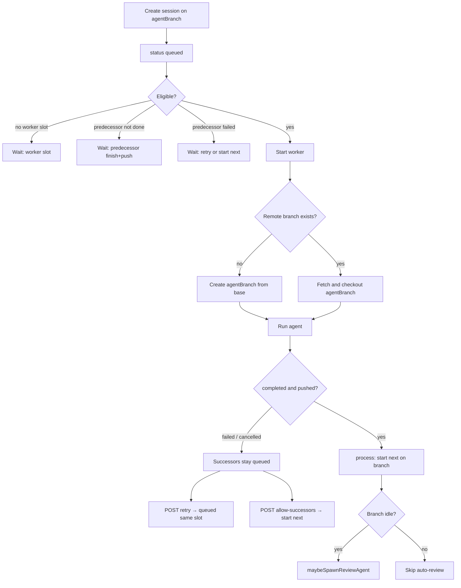

# Shared-branch session queue

Allow multiple agent sessions to **share one project branch** and run **one at a time on that branch**, so a large piece of work can be split into chunks that each commit and push onto the same head.

**Status:** Implemented (phases 1–6 on `shared-branch-queue`). Create no longer 409s on a busy branch; eligibility, host checkout, retry / allow-successors, startup restore, auto-review skip, and wait-reason UI are live.

**Related:** `src/domains/agents/queue-eligibility.ts`, `src/domains/agents/agent-queue.ts`, `src/domains/agents/agent.service.ts` (`createAgent`, `retryAgent`, `allowSuccessors`, `restoreOnStartup`, `maybeSpawnReviewAgent`), `src/domains/agents/worker/workspace-setup.ts` (`checkoutJobBranch`), `docs/initial-build.plan.md` (branch uniqueness)

---

## Goal

Queue several coding sessions against `feature/project` (from `main`). Hardware may still run other branches in parallel (`MAX_CONCURRENT_AGENTS`). On that shared branch:

1. Only one session runs at a time.
2. Session N+1 starts only after N **completed and pushed** (or the user skips N).
3. N+1 **fetches** the remote branch; it does not create a new branch from `main`.
4. If N fails, later chunks **wait** with a visible reason. The user can **retry N in place** or **start the next** chunk anyway.

This is **not** a new scheduler. The existing FIFO worker queue stays. The original gaps (create-time `BRANCH_IN_USE`, checkout that recreated from base, start-gate that dropped blocked IDs, restart that failed `queued`, no wait-reason / retry UI) are closed.

---

## Decisions (locked)

| # | Decision | Choice |
|---|----------|--------|
| 1 | Problem | Same-branch sequential chunks, not a new queue and not “set concurrency to 1” (that remains the env var). |
| 2 | Git handoff | **Push-then-fetch, host-managed.** Always `baseBranch` + `agentBranch`. First occupant creates from base if the remote branch is missing; later occupants fetch `origin/agentBranch`. Isolated workspaces stay. No shared clone, no Pipeline entity. |
| 3 | Failure | **Halt.** Successors stay `queued`. Completed with no push counts as halt. |
| 4 | Retry | **Reset in place.** Same `agentId`, prompt, branch; status → `queued`; fresh clone. Queue slot kept. |
| 5 | Skip | Leave the session `failed`/`cancelled`, set `allowSuccessors: true`, then `process()`. No new status enum. |
| 6 | Concurrency | **Per-branch mutex** plus existing global `MAX_CONCURRENT_AGENTS`. Other branches may run in parallel. |
| 7 | Auto-PR / review | First successful push opens the PR (later chunks reuse by head). **Do not spawn auto-review** while another non-review session is queued or running on that branch. Spawn review when the branch is idle. |
| 8 | Modes | Batch, loop, and interactive may share a branch. Interactive holds the mutex until Finish. Review follows (7). |
| 9 | Restart | Re-enqueue persisted `queued` agents. Running / `awaiting_input` / `processing` / `completing` still fail (worker is dead). |
| 10 | Create UX | Existing New Session form; lift `BRANCH_IN_USE` for extra sessions on the same branch. Optional **Queue another on this branch** prefills repo / base / branch. Order = `createdAt` FIFO. No drag-reorder, no multi-prompt composer. |
| 11 | Wait reasons | Computed on read. Branch-blocked **and** slot-blocked, naming the immediate predecessor. |

### Assumptions (not separately grilled; override if wrong)

- **Retry / Start next** apply to `failed` and `cancelled` only — not `completed` (would duplicate commits).
- Creating a session onto a branch that already has an active or queued session **forces `push: true`**.
- Checkout rule at start: if `origin` has `agentBranch`, fetch; else `git checkout -b` from `baseBranch`.
- No new `AgentStatus` values. Wait reason is derived, not a status.

---

## As-built flow

```
Create(B) while A is queued/running on the same branch → 200, B is queued.
B starts after A completed and pushed (or allowSuccessors).
B workspace clones baseBranch, then fetches origin/agentBranch if it exists.
```



### Implemented

| Item | Location |
|------|----------|
| Lift create-time `BRANCH_IN_USE`; second session on the same branch queues | `agent.service.ts` `createAgent` — no branch-occupancy 409 |
| Per-branch mutex + predecessor gate + skip-without-drop | `queue-eligibility.ts` `decideQueueAction`; `agent-queue.ts` `process()` |
| Force `push: true` when chaining coding sessions | `agent.service.ts` `createAgent` / `retryAgent` (`branchOccupied`) |
| Host checkout from remote existence | `workspace-setup.ts` `checkoutJobBranch`; `git-service.ts` `remoteBranchExists` |
| `allowSuccessors` + `POST .../retry` + `POST .../allow-successors` | `agent.service.ts`, `routes/agents.ts` |
| Derived `agent.queue` on GET/list | `queue-eligibility.ts` `buildAgentQueueState`; attached in `present()` |
| Restore persisted `queued` on startup; fail in-progress workers | `agent.service.ts` `restoreOnStartup` |
| Skip auto-review while a coding successor is queued/running | `maybeSpawnReviewAgent` + `hasActiveCodingOnBranch` |
| Wait reason, Retry, Start next, Queue another | session + list pages, `client/src/api/types.ts` `queueOnBranchPrefill` |
| README: same-branch queue, retry / allow-successors endpoints | `README.md` |

### Remaining gaps (optional / follow-up)

- **Review-mutex test** — `hasLiveWorkerOnBranch` includes running reviews, but there is no dedicated case that a running review blocks a later coding start.
- **Dead `BRANCH_IN_USE` mapping** — still listed in `src/lib/error-handler.ts`; nothing throws it.
- **Create response omits `queue`** — `createAgent` returns the raw record; GET/list attach `queue` via `present()`.
- **Optional `checkoutExisting` on the job** — not persisted; worker still decides fetch vs create from remote existence.
- **README `useExistingBranch` row** — create-body table still describes cloning `baseBranch`; chained sessions do not require that flag.

---

## 1. Lift create-time branch lock; add start-time mutex — done

Create always succeeds as `queued`. Two running workers on one `(repoId, agentBranch)` must never happen. Duplicate in-flight review for the same parent+branches (`isDuplicateBranchReview`) still 409s `DUPLICATE`.

**Start eligibility** (`decideQueueAction` in `queue-eligibility.ts`):

1. `status === 'queued'` or a `completing` agent with no live worker (existing respawn rule).
2. `activeWorkerCount < maxConcurrent` (enforced by `createAgentQueue`, not the predicate).
3. No live worker on the same `(repoId, agentBranch)` (`hasLiveWorkerOnBranch`).
4. Predecessor gate (section 2) — skipped for `mode === 'review'`.

**`process()` does not drop blocked IDs.** `createAgentQueue` takes `decide: (id) => 'start' | 'defer' | 'drop'`:

- `defer` — leave in the list (predecessor / branch mutex).
- `drop` — vanished or terminal IDs.
- `start` — splice and spawn. Scan in enqueue order so a blocked branch X does not starve branch Y.

---

## 2. Predecessor gate — done

**Predecessor** = among non-review agents with the same `(repoId, agentBranch)`, the one with the latest `createdAt` that is still **strictly earlier** than this agent (`findCodingPredecessor`).

| Predecessor state | This agent |
|-------------------|------------|
| none | Eligible (first on the branch). |
| `completed` and `pushed === true` | Eligible. |
| `completed` and not pushed (0 files or `push: false`) | Halt. Wait reason: predecessor did not push. |
| `failed` or `cancelled` with `allowSuccessors === true` | Eligible. |
| `failed` or `cancelled` without flag | Halt. Wait reason: retry or start next. |
| `queued` / running / `awaiting_input` / `processing` / `completing` | Halt. Wait reason: waiting for that session to finish. |

Review agents on the same head **occupy the mutex** while they have a live worker or a branch-worker status. They are **not** coding predecessors: a failed review does not block later coding chunks.

---

## 3. Host-managed checkout — done

`prepareWorkspace` clones `baseBranch`, then `checkoutJobBranch`:

1. If `agentBranch === baseBranch` → stay on the clone.
2. Else if `origin` has `agentBranch` → `fetchAndCheckoutBranch` (shallow unless review).
3. Else → `git checkout -b agentBranch` from the cloned base.

`useExistingBranch` is still stored as the user sent it; the worker decides fetch vs create from **remote existence**, not that flag. Chained creates do **not** require “Push to existing branch.”

**Force `push: true`** when create/retry sees another active/queued session on that `(repoId, agentBranch)`, except reviews.

---

## 4. Halt, retry, start next — done

### Persist

```ts
allowSuccessors?: boolean; // default false; only meaningful when failed/cancelled
```

Wait-reason strings are **not** persisted. `agent.queue` is derived on read.

### Retry — `POST /api/v1/agents/:id/retry`

Allowed when `status` is `failed` or `cancelled`. Same `agentId`; status → `queued`; clears error / result / git outcome; `allowSuccessors: false`; resets loop / interactive runtime fields; appends `Retry requested — re-queued`; `queue.enqueue` then `process()`.

### Start next — `POST /api/v1/agents/:id/allow-successors`

Allowed when `status` is `failed` or `cancelled`. Sets `allowSuccessors: true`, `queue.process()`. Warning when `pushed` is false: `Next chunk will not include this session's work`.

**As-built:** `canAllowSuccessors` is true only when a **queued coding successor** exists (`hasQueuedCodingSuccessor`), so the UI button hides when nothing is waiting.

### Computed `queue` on GET/list

Attached in `present()`, not `withDerivedAgentFields`. `position` is 1-based among **queued on this branch**.

Wait-reason examples:

- `Waiting for abc123 to finish and push`
- `Waiting for abc123 (failed) — retry that session or start next`
- `Waiting for another session on this branch to finish`
- `Waiting for a worker slot`

---

## 5. Restore queued on startup — done

- `queued` → leave queued; enqueue in `createdAt` order, then `process()`.
- Other active statuses → `failed` with `Server restarted while agent was in progress`.
- Shutdown still `queue.clear()` + kill workers; persisted `queued` come back on the next boot.

---

## 6. Auto-PR and auto-review — done

**PR:** `handleAutoCreatePullRequest` on completion. `createPullRequest` attaches an existing GitHub PR by head. Mid-chain pushes update that PR.

**Review:** `maybeSpawnReviewAgent` returns early if `hasActiveCodingOnBranch` (any non-review agent on the same `(repoId, headBranch)` is in `ACTIVE_STATUSES`). When the last coding session completes and no further coding sessions are queued, spawn review as before.

A running review occupies the per-branch mutex, so a later coding session waits.

---

## 7. UI — done

| Surface | Change |
|---------|--------|
| New Session form | Same `agentBranch` no longer 409s. Copy: sessions on this branch run one at a time. |
| Sessions list | Wait reason under status; **Queue another** prefills create. |
| Session page (queued) | Wait reason in header / info; composer uses `queue.reason` instead of “Session is starting…”. |
| Session page (failed/cancelled) | **Retry** and **Start next queued** when `canRetry` / `canAllowSuccessors`. Confirm start-next if `pushed !== true`. |
| Session page / list | **Queue another on this branch** opens the create flyout with repo, `baseBranch`, and `agentBranch` prefilled. |

No Settings control for `MAX_CONCURRENT_AGENTS` (env var remains).

---

## Implementation order

| Phase | Items | Primary files | Status |
|-------|--------|---------------|--------|
| **1** | Eligibility + `process()` skip-without-drop; lift create 409; per-branch mutex; predecessor gate | `queue-eligibility.ts`, `agent-queue.ts`, `agent.service.ts` | Done |
| **2** | Host checkout from remote existence; force `push` when chaining | `workspace-setup.ts`, `git-service.ts`, `agent.service.ts` | Done |
| **3** | `allowSuccessors`, retry + allow-successors APIs, computed `queue` | `types`, `agent.service.ts`, `routes/agents.ts` | Done |
| **4** | Restore `queued` on startup | `agent.service.ts` | Done |
| **5** | Skip auto-review while coding successors exist | `agent.service.ts` `maybeSpawnReviewAgent` | Done |
| **6** | Wait reason, Retry, Start next, Queue another | `client/` session + list pages, `api/types.ts` | Done |

---

## Test plan

| Test | Coverage |
|------|----------|
| Create two agents same `repoId`+`agentBranch` → both `queued` if no slot / first starts, second queued | `agent.service.test.ts` shared-branch queue |
| Two running on same branch never | implied by mutex + first-starts / second-queued |
| Blocked head does not starve other branch | `agent-queue.test.ts`; service “different-branch session while successor blocked” |
| Deferred IDs stay in the queue | `agent-queue.test.ts` skip-without-drop |
| Predecessor not pushed → successor not started | `queue-eligibility.test.ts`; service halt-on-fail |
| `allowSuccessors` → successor starts | `agent.service.test.ts` |
| Retry resets same id to `queued` and starts if eligible | `agent.service.test.ts` |
| Worker checkout: remote branch exists → fetch, else create | `workspace-setup.test.ts` `checkoutJobBranch` |
| Restore: `queued` stays queued and is enqueued; `running` fails | `restoreOnStartup` tests |
| `maybeSpawnReviewAgent` skipped while successor queued | `agent.service.test.ts` |
| Review occupant blocks coding start (mutex) | **not covered** as a dedicated case |

---

## Non-goals

- Changing default `MAX_CONCURRENT_AGENTS` or exposing it in Settings.
- Shared workspace / no-push handoff.
- Pipeline / multi-prompt composer / drag-reorder.
- New `skipped` / `blocked` status values.
- Resuming interactive sessions across restart.
- Retry of `completed` sessions.
- Mid-chain auto-review.

---

## Files

| File | Role |
|------|------|
| `src/domains/agents/queue-eligibility.ts` | Predecessor, mutex, `decideQueueAction`, derived `queue` |
| `src/domains/agents/agent-queue.ts` | Eligible scan; defer vs drop vs start |
| `src/domains/agents/agent.service.ts` | Create (no branch 409), force push, retry, allowSuccessors, restore, review skip |
| `src/types/index.ts` | `allowSuccessors`, `AgentQueueState` |
| `src/routes/agents.ts` | `POST .../retry`, `POST .../allow-successors` |
| `src/domains/agents/worker/workspace-setup.ts` | `checkoutJobBranch` from remote existence |
| `src/services/git-service.ts` | `remoteBranchExists` (`git ls-remote --heads origin`) |
| `client/src/api/types.ts` + `client/src/api/agents.ts` | Queue field, retry / allow-successors clients, `queueOnBranchPrefill` |
| `client/src/pages/AgentSessionPage.tsx` | Wait reason, Retry, Start next, Queue another |
| `client/src/pages/AgentSessionsPage.tsx` | List reason + prefill create |
| `client/src/App.tsx` | Queue-another prefill navigation |
| `README.md` | Same-branch queue; retry / allow-successors endpoints |
