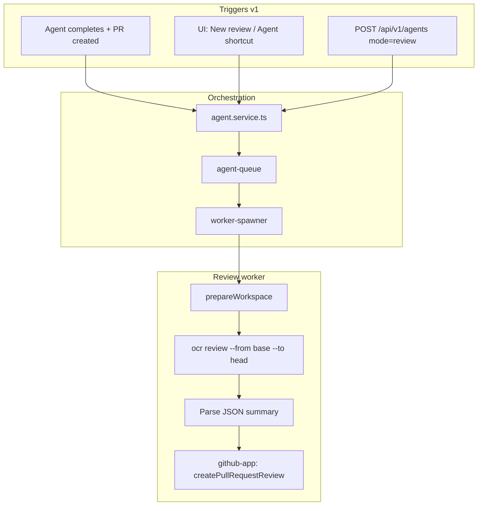

# PR code review — Open Code Review integration

Integrate [Open Code Review (OCR)](https://alibaba.github.io/open-code-review/#/docs) into localagent-box as a first-class **review agent mode**. Reviews run in an isolated workspace (same clone/checkout pipeline as coding agents), use the server's Ollama config, and post summary comments to GitHub when a matching PR exists.

**Status:** Plan (not implemented)

**Related:** [initial-build.plan.md](./initial-build.plan.md), [Open Code Review docs](https://alibaba.github.io/open-code-review/#/docs)

---

## Decisions summary

| # | Decision |
|---|----------|
| 1 | **v1:** auto-review on agent-created PRs; **Phase 2:** GitHub webhooks for all PRs on registered repos |
| 2 | Global default + per-repo override (tri-state: inherit / on / off) |
| 3 | Shared LLM config from server settings; review runs in a full agent workspace (clone → checkout → OCR) |
| 4 | New agent mode: `review` (auto-spawn + manual) |
| 5 | Branch-range scope: `repoId` + `baseBranch` + `headBranch` (API-friendly) |
| 6 | Always post to GitHub when a matching PR exists; always store results on session |
| 7 | Summary-only review body; GitHub event type `COMMENT` |
| 8 | Optional `background` on create; auto-spawn pre-fills from parent agent; repo preamble in `.localagent-box/config.json` |
| 9 | Separate `reviewModel` in Settings; falls back to `opencodeModel` |
| 10 | Global toggle default **off**; repo unset inherits global |
| 11 | UI: "New review session" form + "Review branches" shortcut on agent sessions |
| 12 | Auto-spawn skips if same PR + head SHA already reviewed; manual/API always runs |

---

## Architecture



Review sessions reuse the existing worker pipeline (`worker-spawner` → `agent-worker` → `prepareWorkspace`). The `review` run flow replaces OpenCode with OCR.

---

## Phase 1 — Core review mode

### 1.1 Dependencies & packaging

- Add `@alibaba-group/open-code-review` to the Docker image (mirror OpenCode install):

```dockerfile
RUN npm install -g @alibaba-group/open-code-review
```

- Add a small integration module: `src/integrations/open-code-review/` with:
  - `writeOcrConfig(config, workspaceDir)` — transient OCR config pointing at server `ollamaBaseUrl` + resolved `reviewModel`
  - `runOcrReview(opts)` — spawn `ocr review --repo {workspace} --from {base} --to {head} --format json --audience agent -b {background}`

### 1.2 Types & config

**`AppConfig`** (`src/types/index.ts`, `config-store.ts`):

- `autoReviewPullRequests: boolean` (default `false`)
- `reviewModel: string` (default `''` → fallback to `opencodeModel`)

**`Repo`** (`src/types/index.ts`):

- `autoReviewPullRequests: boolean | null` (`null` = inherit global)

**`Agent`** extensions:

- `mode: 'review'` added to `AgentMode`
- `parentAgentId?: string` — links auto-spawned review to coding agent
- `review?: { baseBranch, headBranch, background?, ocrResultPath?, githubReviewId?, headSha?, prNumber? }`

**`.localagent-box/config.json`** (`repo-config.ts`):

- `reviewBackground?: string` — static preamble merged into OCR `--background`

**Resolution helper** (mirror `autoCreatePullRequest`):

```typescript
resolveAutoReviewPullRequests(agent, repo, globalConfig): boolean
// agent override (future) → repo.autoReviewPullRequests ?? global.autoReviewPullRequests
```

### 1.3 Repo settings API & UI

New infrastructure (doesn't exist today):

| Layer | Change |
|-------|--------|
| `repo.repository.ts` | `updateRepo(repoId, partial)` |
| `repo.service.ts` | validate + merge |
| `routes/repos.ts` | `PUT /api/v1/repos/:repoId` |
| `RepositoriesPage.tsx` | Toggle: "Auto-review pull requests" (inherit / on / off) |
| `SettingsPage.tsx` | Global toggle + `reviewModel` field |
| `client/src/api/types.ts` | Sync types |

### 1.4 Review worker flow

New file: `src/domains/agents/worker/review-run-flow.ts`

```
1. prepareWorkspace (existing)
   - clone repo @ baseBranch
   - useExistingBranch: true → checkout headBranch (fetch from origin)
2. writeOcrConfig from server settings
3. Build background string:
   - repo.reviewBackground (from .localagent-box/config.json)
   - + caller background (if provided)
   - + auto-spawn: parent agent task + truncated transcript
4. ocr review --from {baseBranch} --to {headBranch} --format json --audience agent
5. Store raw JSON in agents/{id}/review-result.json
6. Resolve head SHA; find matching PR via github-app.findPullRequestByHead
7. If PR found → createPullRequestReview (COMMENT, markdown body from OCR summary)
8. Update agent record: status completed, review metadata
9. No commit/push (read-only session)
```

Wire in `agent-worker.ts`:

```typescript
if (getAgentMode(job) === 'review') {
  await runReviewJob(ctx);
}
```

### 1.5 GitHub integration

Extend `src/services/github-app.ts`:

- `findPullRequestByHead(owner, name, headBranch, baseBranch?)` — may already exist partially
- `createPullRequestReview(owner, name, prNumber, { body, event: 'COMMENT' })`

### 1.6 Auto-spawn hook

In `agent.service.ts`, after successful `createPullRequest()`:

```
if resolveAutoReviewPullRequests(...) && !alreadyReviewed(prNumber, headSha):
  createAgent({
    mode: 'review',
    repoId, baseBranch, headBranch: agentBranch,
    useExistingBranch: true,
    parentAgentId: agent.agentId,
    background: buildFromParentAgent(agent),
  })
```

Dedup: store `{ prNumber, headSha, reviewAgentId }` on parent agent's `pullRequest` or a `reviews.json` index. Skip auto-spawn when head SHA unchanged.

### 1.7 API — create review session

Extend `POST /api/v1/agents` validation:

```json
{
  "mode": "review",
  "repoId": "abc123",
  "baseBranch": "main",
  "headBranch": "feature/foo",
  "background": "optional requirement context",
  "parentAgentId": "optional"
}
```

Review sessions: no `prompt` required, no commit/push, no OpenCode. Returns standard agent response with `agentId` for polling.

Existing endpoints work unchanged:

- `GET /api/v1/agents/:id` — includes `review` metadata
- `GET /api/v1/agents/:id/events` — OCR log lines via `appendLog`
- `GET /api/v1/agents/:id/logs`

### 1.8 UI

| Surface | Change |
|---------|--------|
| **Settings** | Global "Auto-review pull requests" toggle; `reviewModel` input |
| **Repositories** | Per-repo toggle (inherit / on / off) via `PUT` |
| **Agent Sessions** | Filter/badge for `review` mode; show review status + GitHub link |
| **New review form** | Repo picker, base branch, head branch, optional background |
| **Agent session shortcut** | "Review branches" on completed agents → pre-fill branches |
| **Agent session info** | Show linked review session (`parentAgentId` / child review) |

### 1.9 Failure semantics

| Scenario | Status | Notes |
|----------|--------|-------|
| OCR fails | `failed` | Error on agent record |
| OCR ok, no matching PR | `completed` | Results in session; log "no PR found, skipped GitHub post" |
| OCR ok, PR found, GitHub post fails | `completed` + warning | Review JSON available; warning on agent record |
| Auto-spawn dedup hit | No session created | Log on parent agent |

---

## Phase 2 — Webhook-driven reviews

### 2.1 GitHub App webhook endpoint

New route: `POST /api/v1/webhooks/github`

- Verify signature (GitHub App webhook secret)
- Handle `pull_request` events: `opened`, `synchronize` (push to PR branch)
- Filter: registered repo + `resolveAutoReviewPullRequests` enabled
- Dedup: same PR + head SHA logic as v1
- Spawn `review` agent with branches from webhook payload

### 2.2 GitHub App configuration

- Register webhook URL on the GitHub App
- Permissions: `Pull requests: Read & write` (likely already present)
- Events: `Pull request`

### 2.3 Dedup on `synchronize`

When PR branch is force-pushed (new head SHA), auto-review runs again — dedup allows this since SHA changed.

---

## File checklist

| Area | Files |
|------|-------|
| **New** | `src/integrations/open-code-review/runner.ts`, `src/domains/agents/worker/review-run-flow.ts`, `src/lib/review-background.ts`, `src/lib/resolve-auto-review.ts` |
| **Types** | `src/types/index.ts` |
| **Config** | `src/services/config-store.ts`, `src/domains/agents/worker/repo-config.ts` |
| **Repos** | `src/domains/repos/repo.repository.ts`, `repo.service.ts`, `src/routes/repos.ts` |
| **Agents** | `agent.service.ts`, `agent.validation.ts`, `agent-worker.ts`, `worker-spawner.ts`, `dto.ts` |
| **GitHub** | `src/services/github-app.ts` |
| **Client** | `SettingsPage.tsx`, `RepositoriesPage.tsx`, `AgentSessionsPage.tsx`, `AgentSessionPage.tsx`, `api/types.ts`, `api/agents.ts`, `api/repos.ts` |
| **Docker** | `Dockerfile` |
| **Tests** | Mirror patterns in `agent.service.test.ts`, `repo-config.test.ts`, new `review-run-flow.test.ts` |

---

## Suggested implementation order

1. **Types + config** — `reviewModel`, toggles, repo `PUT` API
2. **OCR integration module** — config generation + subprocess wrapper (unit test with mock)
3. **`review` worker flow** — workspace + OCR + result storage
4. **GitHub review API** — find PR + post summary
5. **Agent create API** — review mode validation + queue
6. **Auto-spawn hook** — after PR creation, with dedup
7. **UI** — Settings toggle, repo toggle, review session form, agent shortcut
8. **Phase 2** — webhook endpoint (can ship independently)

---

## Open items (defer, don't block v1)

- **Line-level review comments** — revisit if summary-only feels thin
- **Review verdict** (`REQUEST_CHANGES` / `APPROVE`) — policy decision for later
- **`ocr viewer` WebUI** — optional embed for browsing session logs
- **Custom OCR `rule.json` per repo** — via `.localagent-box/review-rules.json` if needed
- **Concurrency limits** — cap simultaneous review workers if cost becomes an issue
