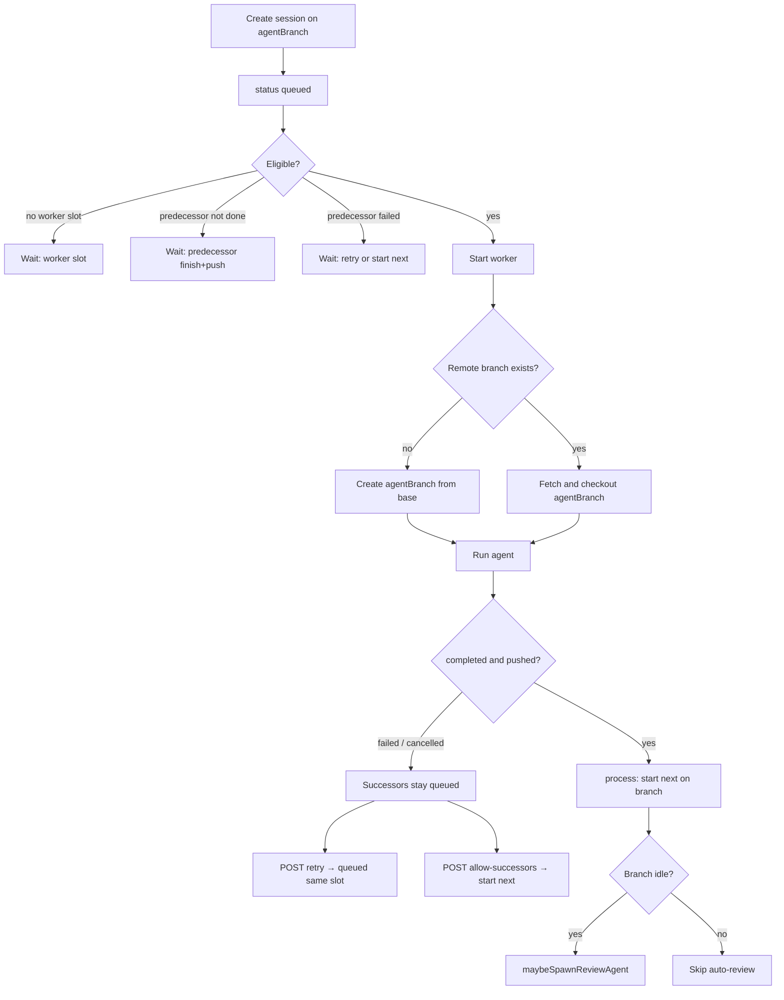

# Shared-branch session queue

Allow multiple agent sessions to **share one project branch** and run **one at a time on that branch**, so a large piece of work can be split into chunks that each commit and push onto the same head.

**Status:** Phases 1–5 implemented (queue eligibility, host checkout, retry / allow-successors / computed `queue`, restore `queued` on startup, skip auto-review while coding successors exist). Phase 6 not started.

**Related:** `src/domains/agents/agent-queue.ts`, `src/domains/agents/agent.service.ts` (`branchInUse`, `restoreOnStartup`), `src/domains/agents/worker/workspace-setup.ts`, `docs/initial-build.plan.md` (branch uniqueness)

---

## Goal

Queue several coding sessions against `feature/project` (from `main`). Hardware may still run other branches in parallel (`MAX_CONCURRENT_AGENTS`). On that shared branch:

1. Only one session runs at a time.
2. Session N+1 starts only after N **completed and pushed** (or the user skips N).
3. N+1 **fetches** the remote branch; it does not create a new branch from `main`.
4. If N fails, later chunks **wait** with a visible reason. The user can **retry N in place** or **start the next** chunk anyway.

This is **not** a new scheduler. The existing FIFO worker queue stays. The gaps are: create-time `BRANCH_IN_USE` (queued counts as occupying), checkout that would recreate the branch from base, start-gate that drops blocked IDs, restart that fails `queued`, and no wait-reason / retry / continue UI.

---

## Decisions (locked)

| # | Decision | Choice |
|---|----------|--------|
| 1 | Problem | Same-branch sequential chunks, not a new queue and not “set concurrency to 1” (that remains the env var). |
| 2 | Git handoff | **Push-then-fetch, host-managed.** Always `baseBranch` + `agentBranch`. First occupant creates from base if the remote branch is missing; later occupants fetch `origin/agentBranch`. Isolated workspaces stay. No shared clone, no Pipeline entity. |
| 3 | Failure | **Halt.** Successors stay `queued`. Completed with no push counts as halt. |
| 4 | Retry | **Reset in place.** Same `agentId`, prompt, branch; status → `queued`; fresh clone. Queue slot kept. |
| 5 | Skip | Leave the session `failed`/`cancelled`, set `allowSuccessors: true`, then `process()`. No new status enum. |
| 6 | Concurrency | **Per-branch mutex** plus existing global `MAX_CONCURRENT_AGENTS`. Other branches may run in parallel. |
| 7 | Auto-PR / review | First successful push opens the PR (later chunks reuse by head). **Do not spawn auto-review** while another non-review session is queued or running on that branch. Spawn review when the branch is idle. |
| 8 | Modes | Batch, loop, and interactive may share a branch. Interactive holds the mutex until Finish. Review follows (7). |
| 9 | Restart | Re-enqueue persisted `queued` agents. Running / `awaiting_input` / `processing` / `completing` still fail (worker is dead). |
| 10 | Create UX | Existing New Session form; lift `BRANCH_IN_USE` for extra sessions on the same branch. Optional **Queue another on this branch** prefills repo / base / branch. Order = `createdAt` FIFO. No drag-reorder, no multi-prompt composer. |
| 11 | Wait reasons | Computed on read. Branch-blocked **and** slot-blocked, naming the immediate predecessor. |

### Assumptions (not separately grilled; override if wrong)

- **Retry / Start next** apply to `failed` and `cancelled` only — not `completed` (would duplicate commits).
- Creating a session onto a branch that already has an active or queued session **forces `push: true`**.
- Checkout rule at start: if `origin` has `agentBranch`, fetch; else `git checkout -b` from `baseBranch`.
- No new `AgentStatus` values. Wait reason is derived, not a status.

---

## Current vs target

```
Today:  create(B) while A is queued/running on same branch → 409 BRANCH_IN_USE
Target: create(B) succeeds (queued). B starts after A pushed (or allowSuccessors).
        B workspace fetches origin/agentBranch, then runs.
```



---

## 1. Lift create-time branch lock; add start-time mutex

**Today:** `branchInUse` treats any `ACTIVE_STATUSES` agent (including `queued`) as occupying the branch, so a second create 409s.

**Change:**

- Allow multiple `queued` (and one running) sessions with the same `(repoId, agentBranch)`.
- **Reject** create only if another session on that branch is already **running a worker** (`running` / `awaiting_input` / `processing` / `completing`) *and* we would start the new one immediately? **No** — create always succeeds as `queued`; the mutex is at **start**, not create. Two running workers on one branch must never happen.
- Still 409 duplicate **in-flight review** for the same parent+branches (`isDuplicateBranchReview`) — unchanged.

**Start eligibility** (`canStart(agent)`):

1. `status === 'queued'` (existing `completing` respawn rule unchanged).
2. `activeWorkerCount < maxConcurrent`.
3. No live worker on the same `(repoId, agentBranch)`.
4. Predecessor gate (section 2).

**`process()` must not drop blocked IDs.** Today `shouldStart === false` after `shift()` **removes** the agent from the in-memory queue forever. That is correct for vanished/cancelled IDs, **wrong** for “predecessor not ready.”

Change `createAgentQueue` to:

- Keep blocked agents in the list.
- Start the **first eligible** ID, not strictly the head, so a blocked branch X does not starve branch Y.
- Fairness: scan in enqueue/`createdAt` order; do not reshuffle.

Suggested shape:

```ts
function process(): void {
  while (options.getActiveWorkerCount() < options.maxConcurrent) {
    const index = queue.findIndex((id) => options.shouldStart(id));
    if (index === -1) break;
    const agentId = queue.splice(index, 1)[0];
    options.onStartAgent(agentId);
  }
}
```

`shouldStart` becomes the full eligibility predicate (including predecessor + per-branch mutex).

---

## 2. Predecessor gate

**Predecessor** = among agents with the same `(repoId, agentBranch)`, the one with the latest `createdAt` that is still **strictly earlier** than this agent (ignore deleted).

| Predecessor state | This agent |
|-------------------|------------|
| none | Eligible (first on the branch). |
| `completed` and `pushed === true` | Eligible. |
| `completed` and not pushed (0 files or `push: false`) | Halt. Wait reason: predecessor did not push. |
| `failed` or `cancelled` with `allowSuccessors === true` | Eligible. |
| `failed` or `cancelled` without flag | Halt. Wait reason: retry or start next. |
| `queued` / running / `awaiting_input` / `processing` / `completing` | Halt. Wait reason: waiting for that session to finish. |

Review agents on the same head **occupy the mutex** while queued/running (they check out the branch). They are **not** coding predecessors for the halt-on-failure rule: a failed review should not block later coding chunks. Treat `mode === 'review'` as mutex occupants only; skip them when walking the coding predecessor chain.

---

## 3. Host-managed checkout

`prepareWorkspace` today: clone `baseBranch`, then either `checkout -b agentBranch` or (if `useExistingBranch`) stay on / fetch `agentBranch`. Create validation **forces** `agentBranch = baseBranch` when `useExistingBranch` is true, which would make PR base wrong for this workflow.

**Do not require the user to check “Push to existing branch” on chunks 2..N.**

At worker start:

1. Clone `baseBranch` as today (PR base stays `main`).
2. If `origin` has `agentBranch` → fetch and checkout (shallow unless review).
3. Else → `git checkout -b agentBranch` from the cloned base.

Retry of a session that already pushed uses (2). “Start next” when nothing was ever pushed uses (3) for the successor.

Keep storing `useExistingBranch` as the user sent it; the worker decides fetch vs create from **remote existence**, not that flag. Optional later: persist `checkoutExisting: true` on the job for logs.

**Force `push: true`** when create sees another active/queued session on that `(repoId, agentBranch)`.

---

## 4. Halt, retry, start next

### Persist

On `Agent`:

```ts
allowSuccessors?: boolean; // default false; only meaningful when failed/cancelled
```

Do **not** persist wait-reason strings.

### Retry — `POST /api/v1/agents/:id/retry`

Allowed when `status` is `failed` or `cancelled`.

Reset in place:

- `status: 'queued'`, clear `error`, `finishedAt`, `result`, `startedAt`, `commitSha` / `pushed` / `filesChanged` as appropriate (do **not** clear `allowSuccessors` on *this* record in a way that affects others; this agent is no longer a failed predecessor).
- `allowSuccessors: false` on the retried agent.
- Reset loop / interactive runtime fields (`buildLoopState('queued')`, `buildInteractiveState('queued')`, etc.).
- Keep `prompt`, `agentBranch`, `baseBranch`, `mode`, `model`, `workspaceId` (workspace dir is wiped on next `prepareWorkspace`).
- Append a log line `Retry requested — re-queued`.
- `queue.enqueue(agentId)` then `process()`.

Leave events/messages/logs in place (append). Do not rotate `agentId`.

### Start next — `POST /api/v1/agents/:id/allow-successors`

Allowed when `status` is `failed` or `cancelled`.

Set `allowSuccessors: true`, `queue.process()`. If nothing was pushed, the API can include `warning: 'next chunk will not include this session\'s work'` for the UI confirm copy.

### Computed `queue` on GET/list

```ts
interface AgentQueueState {
  position: number | null;           // 1-based among queued on this branch, or among global queued
  waitingOn: 'predecessor' | 'slot' | 'branch_worker' | null;
  predecessorId: string | null;
  predecessorStatus: AgentStatus | null;
  reason: string | null;             // human string for UI
  canRetry: boolean;
  canAllowSuccessors: boolean;
}
```

Attach as `agent.queue` (derived in `withDerivedAgentFields`). Examples:

- `Waiting for abc123 to finish and push`
- `Waiting for abc123 (failed) — retry that session or start next`
- `Waiting for a worker slot`

---

## 5. Restore queued on startup

`restoreOnStartup` today fails **all** `ACTIVE_STATUSES`, including `queued`.

**Change:**

- `queued` → leave queued; collect IDs.
- Other active statuses → `failed` as today.
- After save: `queue.clear()` is wrong on startup (queue is empty). Enqueue remaining `queued` agents in `createdAt` order, then `process()`.

Shutdown still `queue.clear()` + kill workers; persisted `queued` come back on the next boot via restore.

---

## 6. Auto-PR and auto-review

**PR:** Keep `handleAutoCreatePullRequest` on completion. `createPullRequest` already attaches an existing GitHub PR by head. Mid-chain pushes update that PR.

**Review:** In `maybeSpawnReviewAgent`, return early if any **non-review** agent on the same `(repoId, headBranch)` is `queued` or has a live worker. When the last coding session on that branch completes (and no further coding sessions are queued), spawn review as today.

If a review is already running and the user queues another coding session, the per-branch mutex makes the coding session wait (same as any occupant).

---

## 7. UI

| Surface | Change |
|---------|--------|
| New Session form | Same `agentBranch` no longer 409s. Optional copy: sessions on this branch run one at a time. |
| Sessions list | Show wait reason under status when `agent.queue.reason` is set. |
| Session page (queued) | Replace “Session is starting…” with the wait reason when not eligible. |
| Session page (failed/cancelled) | **Retry** and **Start next queued** when `canRetry` / `canAllowSuccessors`. Confirm start-next if `pushed !== true`. |
| Session page / list | **Queue another on this branch** opens the existing create flyout with repo, `baseBranch`, and `agentBranch` prefilled. |
| Composer disabled reason | Do not say “starting” when the session is branch-blocked. |

No Settings control for `MAX_CONCURRENT_AGENTS` in this pass (env var remains).

---

## Implementation order

| Phase | Items | Primary files | Shippable alone? |
|-------|--------|---------------|------------------|
| **1** | Eligibility + `process()` skip-without-drop; lift create 409; per-branch mutex; predecessor gate | `agent-queue.ts`, `agent.service.ts` | Yes (no UI) |
| **2** | Host checkout from remote existence; force `push` when chaining | `workspace-setup.ts`, `git-service.ts`, `agent.service.ts` | Yes |
| **3** | `allowSuccessors`, retry + allow-successors APIs, computed `queue` | `types`, `agent.service.ts`, `routes/agents.ts` | Yes |
| **4** | Restore `queued` on startup | `agent.service.ts` | Yes |
| **5** | Skip auto-review while coding successors exist | `agent.service.ts` `maybeSpawnReviewAgent` | Yes |
| **6** | Wait reason, Retry, Start next, Queue another | `client/` session + list pages, `api/types.ts` | Yes |

---

## Test plan

| Test | Notes |
|------|--------|
| Create two agents same `repoId`+`agentBranch` → both `queued` if no slot / first starts, second queued | No 409 |
| Two running on same branch never | Mutex |
| Blocked head does not starve other branch | `process()` skip |
| `shouldStart` false no longer permanently drops a still-queued agent | Queue regression |
| Predecessor not pushed → successor not started | Halt |
| `allowSuccessors` → successor starts | Skip |
| Retry resets same id to `queued` and starts if eligible | In-place |
| Worker checkout: remote branch exists → fetch, else create | Mock git |
| Restore: `queued` stays queued and is enqueued; `running` fails | Startup |
| `maybeSpawnReviewAgent` skipped while successor queued | Review |
| Review occupant blocks coding start (mutex) | Review vs chain |

There is no dedicated `agent-queue` test file today; add `agent-queue.test.ts` for skip-without-drop, plus cases in `agent.service.test.ts`.

---

## Non-goals

- Changing default `MAX_CONCURRENT_AGENTS` or exposing it in Settings.
- Shared workspace / no-push handoff.
- Pipeline / multi-prompt composer / drag-reorder.
- New `skipped` / `blocked` status values.
- Resuming interactive sessions across restart.
- Retry of `completed` sessions.
- Mid-chain auto-review.

---

## Files to touch

| File | Why |
|------|-----|
| `src/domains/agents/agent-queue.ts` | Eligible scan; do not drop blocked IDs |
| `src/domains/agents/agent.service.ts` | Create lock, eligibility, restore, retry, allowSuccessors, review skip, force push |
| `src/domains/agents/agent.types.ts` | Derived `queue` helper if kept next to other with* fields |
| `src/types/index.ts` | `allowSuccessors`, `AgentQueueState` |
| `src/routes/agents.ts` | `POST .../retry`, `POST .../allow-successors` |
| `src/domains/agents/worker/workspace-setup.ts` | Fetch vs create from remote |
| `src/services/git-service.ts` | `remoteBranchExists` (or equivalent) if not already there |
| `client/src/api/types.ts` + agents API | Queue field, retry/continue clients |
| `client/src/pages/AgentSessionPage.tsx` | Wait reason, Retry, Start next, Queue another |
| `client/src/pages/AgentSessionsPage.tsx` | List reason + prefill create |
| `README.md` | Document same-branch queue; `BRANCH_IN_USE` no longer applies to queued duplicates |
